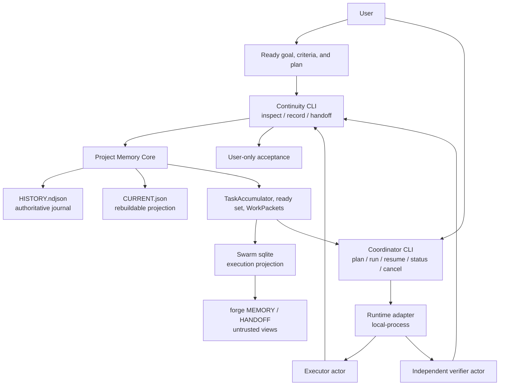

# Architecture

Continuity is four layers in one repository. They share a versioned protocol. They do not share write authority.

Product version comes from `package.json` at runtime (`3.0.0`). Store schema is **v3** and is printed separately (`--help`, `init --schema 3`, inspect/history documents). Do not treat those numbers as the same thing.

## Layers

| Layer | Job | Not its job |
| --- | --- | --- |
| **Project Memory Core** | Own long-term recorded truth | Choose a model, launch a process, accept work for the user |
| **Continuity** | Read/continuity plane for the next chat or actor | Become Coordinator or start executors |
| **Coordinator** | Sequential execution plane: packets, adapters, waves, resume | Edit the journal, treat reports as proof, accept for the user |
| **Swarm** | Parallel execution plane: sqlite execution projection with journal task/event ids, deterministic `launch.mjs` role-workers, path leases, standing order | Edit the journal, accept for the user, spawn host Task, overlap path ownership |

1. **Project Memory Core** owns the append-only journal `.continuity/HISTORY.ndjson`. Core `HISTORY` is truth. `.continuity/CURRENT.json` is a rebuildable projection, not a second source of truth. The journal fails closed at 8 MiB and hash-chains events. The CURRENT projection fails closed at 256 KiB; that bound is an implementation cap on the folded snapshot, not a license to compact or rewrite HISTORY, and it is not the 8 MiB journal bound. CURRENT is a slimmed fold (duplicate ownership and released-assignment path lists are omitted) so hours-long journals stay under the cap. Oversize CURRENT writes error and leave HISTORY unchanged. Unknown fields are rejected. Secret-pattern text guards live in the protocol (`continuity/scripts/lib/protocol/secrets.mjs`), not Core. A rejected write leaves the store unchanged.
2. **Continuity** orients a new chat (`doctor`, `inspect`), emits bounded handoff, and recomputes freshness from live Git. The Memory CLI does not launch actors. The Skill `/continuity` makes the host coding agent the Conductor: it recovers memory, and the host LLM dispatches Task sub-agents. If `inspect ready` reports `plan.missing`, stop assigning; do not invent missing requirements or slice a product. `history --tail N` is last N journal event summaries.
3. **Coordinator** consumes ready work through the protocol, launches adapters, and writes back only through the Continuity CLI.
4. **Swarm** is the parallel runtime. `launch.mjs` runs deterministic role-workers plus sqlite and the HTTP control surface on `127.0.0.1:43147`. Node does not spawn host Task. The host LLM dispatches Task sub-agents. Swarm owns `data/swarm.sqlite` (an execution projection with journal task/event ids) and `forge/` views, not the journal. Markdown (forge `MEMORY.md` / `HANDOFF.md`) is a view, not a store. It never accepts for the user. `mission.accepted` is not user accept. Only `record accept --as user` accepts. Role coverage is analysis, implementation, independent verification, security, and review on disjoint path leases. A Manager appears at size 10+.

Core never selects a model, launches a process, or accepts work for the user. Coordinator never edits `HISTORY` files or projection files and never accepts for the user. Swarm never edits the journal. Core `HISTORY` is truth. Swarm sqlite is an execution projection with journal task/event ids. Markdown (forge `MEMORY.md` / `HANDOFF.md`) is a view, not a store.

You talk to Core and Continuity through `continuity.mjs`. You talk to agent management through a separate foreground CLI, `coordinator.mjs`. Memory never starts Coordinator. Coordinator never starts as a daemon, watcher, login task, or network service. The optional Swarm control surface is a local `127.0.0.1:43147` listener owned by foreground `launch.mjs`, not Coordinator.

The Skill/code lives in `continuity/`. Project data lives in the target Git repository as `.continuity/`. Coordinator run state, if used, lives in `.continuity/coordinator/runs`.

Stable protocol identifier: `project-memory.coordinator.v1`. That string is a compatibility id, not the product name. See [PROTOCOL.md](PROTOCOL.md).

## Project contour

These are not a required pipeline. Direct Memory use and coordinated execution are alternative modes.



## Write path and read path

Every durable **journal** write goes through `continuity/scripts/continuity.mjs`. Coordinator may only spawn that CLI (or an equivalent validated Core API). It must not open `HISTORY.ndjson` or `CURRENT.json` itself. Rejected writes leave the journal unchanged. Executor prose is stored as a report and is not authorizing evidence.

Core `HISTORY` is truth. Swarm `data/swarm.sqlite` is an execution projection with journal task/event ids, not a second canon. Markdown (`forge/MEMORY.md`, `forge/HANDOFF.md`) is an untrusted view. Those projection and view files are not journal writes and do not go through `continuity.mjs`.

`inspect`, `inspect ready`, `inspect wave`, `handoff`, `doctor`, `validate`, and `history` do not repair the projection. `rebuild` is an explicit operator write.

## Profiles

| Profile | Contains | Works without |
| --- | --- | --- |
| Memory | Core + Continuity + protocol + CLI | Coordinator |
| Coordinator | Coordinator runtime + protocol client + adapters | Journal implementation |
| Full | Memory + Coordinator + Swarm (`launch.mjs`, sqlite projection, local control surface) | Nothing extra for local CLI use |

Coordinator-only installs require a compatible Memory/Continuity CLI. Point `memoryCli` at that CLI in the Coordinator config file (`--config <file>`), or use the bundled CLI in the Full profile.

Ready-set scheduling is deterministic. Memory does not launch the scheduled actors. Coordinator does, through an adapter you configure explicitly.

## Repository layout

```text
.
├── continuity/                 # installable product tree
│   ├── SKILL.md
│   ├── package.json            # product version for a copied Skill tree
│   ├── assets/
│   ├── references/
│   └── scripts/
│       ├── continuity.mjs
│       ├── coordinator.mjs
│       ├── launch.mjs
│       ├── dispatch.mjs
│       ├── control-surface.mjs
│       ├── project-memory.mjs  # compatibility alias
│       ├── smokes/
│       └── lib/core|protocol|coordinator|swarm
├── tests/ scripts/ examples/
├── AGENTS.md ARCHITECTURE.md PROTOCOL.md INSTALL.md
├── COORDINATOR.md ADAPTERS.md MIGRATION.md RELEASE.md CHANGELOG.md
├── COMPETITORS.md COMPETITORS.ru.md
├── README.md README.ru.md SECURITY.md LICENSE
└── package.json
```

`.continuity/` belongs at a **target** repository. Do not ship it. Do not put it in this Git tree. `npm pack` is not the installation unit; install from `continuity/` or a profile zip. File counts are owned by `scripts/package-inventory.mjs`, not by this document.

## Identity

`project-memory.coordinator.v1` is the stable protocol identifier. It is not the product name.

## FAQ

**Why isn't Memory enough?**  
Memory remembers. It does not launch executors, isolate overlapping ownership at process start, or run an independent verifier actor. Download Full when you need Coordinator (sequential) and/or Swarm (`launch.mjs`, parallel Node role-workers + local control surface). Coordinator and Swarm are different execution planes; neither accepts for the user.

**Does Coordinator replace Continuity?**  
No. Coordinator is useless without a Memory/Continuity endpoint or local CLI. It has no duplicate journal.

**Can Coordinator accept the work?**  
No. Coordinator does not accept for the user and does not edit `HISTORY` files. Clicking Accept on the HTTP control surface is not user accept. `mission.accepted` is not user accept. Only `record accept --as user` accepts.

**Which profile should I download?**  
Full for both jobs. Memory for journal-only. Coordinator if Memory already exists elsewhere. Verify `SHA256SUMS`.

**Is the journal tamper-proof?**  
No. Hash-chaining detects casual breakage. See [SECURITY.md](SECURITY.md).
