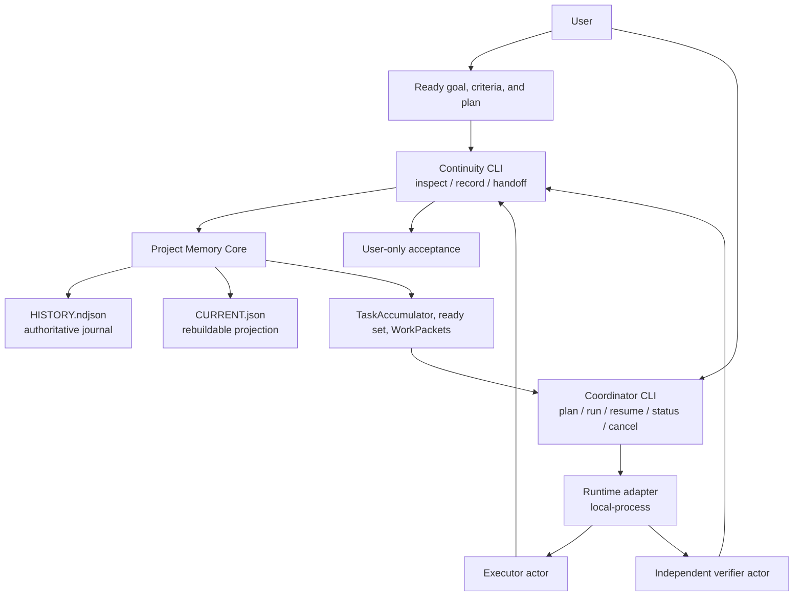

# Architecture

Continuity is three layers in one repository. They share a versioned protocol. They do not share write authority.

Product version comes from `package.json` at runtime (`3.0.0`). Store schema is **v3** and is printed separately (`--help`, `init --schema 3`, inspect/history documents). Do not treat those numbers as the same thing.

## Layers

| Layer | Job | Not its job |
| --- | --- | --- |
| **Project Memory Core** | Own long-term recorded truth | Choose a model, launch a process, accept work for the user |
| **Continuity** | Read/continuity plane for the next chat or actor | Become Coordinator or start executors |
| **Coordinator** | Execution plane: packets, adapters, waves, resume | Edit the journal, treat reports as proof, accept for the user |

1. **Project Memory Core** owns the append-only journal `.continuity/HISTORY.ndjson`. `.continuity/CURRENT.json` is a rebuildable projection, not a second source of truth. The journal fails closed at 8 MiB. Unknown fields and recognizable secret patterns are rejected. A rejected write leaves the store unchanged.
2. **Continuity** orients a new chat (`doctor`, `inspect`), emits bounded handoff, and recomputes freshness from live Git. It does not launch actors.
3. **Coordinator** consumes ready work through the protocol, launches adapters, and writes back only through the Continuity CLI.

Core never selects a model, launches a process, or accepts work for the user. Coordinator never edits the journal or projection files.

You talk to Core and Continuity through `continuity.mjs`. You talk to agent management through a separate foreground CLI, `coordinator.mjs`. Memory never starts Coordinator. Coordinator never starts as a daemon, watcher, login task, or network service.

The Skill/code lives in `continuity/`. Project data lives in the target Git repository as `.continuity/`. Coordinator run state, if used, lives in `.continuity/coordinator/runs`.

Stable protocol identifier: `project-memory.coordinator.v1`. That string is a compatibility id, not the product name. See [PROTOCOL.md](PROTOCOL.md).

## Project contour

These are not a required pipeline. Direct Memory use and coordinated execution are alternative modes.



## Write path and read path

Every durable write goes through `continuity/scripts/continuity.mjs`. Coordinator may only spawn that CLI (or an equivalent validated Core API). It must not open `HISTORY.ndjson` or `CURRENT.json` itself. Rejected writes leave the journal unchanged. Executor prose is stored as a report and is not authorizing evidence.

`inspect`, `inspect ready`, `inspect wave`, `handoff`, `doctor`, `validate`, and `history` do not repair the projection. `rebuild` is an explicit operator write.

## Profiles

| Profile | Contains | Works without |
| --- | --- | --- |
| Memory | Core + Continuity + protocol + CLI | Coordinator |
| Coordinator | Coordinator runtime + protocol client + adapters | Journal implementation |
| Full | All of the above | Nothing extra for local CLI use |

Coordinator-only installs require a compatible Memory/Continuity CLI. Point `memoryCli` at that CLI in the Coordinator config file (`--config <file>`), or use the bundled CLI in the Full profile.

Ready-set scheduling is deterministic. Memory does not launch the scheduled actors. Coordinator does, through an adapter you configure explicitly.

## Repository layout

```text
.
├── continuity/                 # installable product tree
│   ├── SKILL.md
│   ├── package.json            # product version for a copied Skill tree
│   ├── assets/
│   ├── references/
│   └── scripts/
│       ├── continuity.mjs
│       ├── coordinator.mjs
│       ├── project-memory.mjs  # compatibility alias
│       ├── smokes/
│       └── lib/core|protocol|coordinator
├── tests/ scripts/ examples/
├── AGENTS.md ARCHITECTURE.md PROTOCOL.md INSTALL.md
├── COORDINATOR.md ADAPTERS.md MIGRATION.md RELEASE.md CHANGELOG.md
├── README.md README.ru.md SECURITY.md LICENSE
└── package.json
```

`.continuity/` belongs at a **target** repository. Do not ship it. Do not put it in this Git tree. `npm pack` is not the installation unit; install from `continuity/` or a profile zip. File counts are owned by `scripts/package-inventory.mjs`, not by this document.

## Identity

`project-memory.coordinator.v1` is the stable protocol identifier. It is not the product name.

## FAQ

**Why isn't Memory enough?**  
Memory remembers. It does not launch executors, isolate overlapping ownership at process start, or run an independent verifier actor. Download Full or Coordinator when you need that management loop.

**Does Coordinator replace Continuity?**  
No. Coordinator is useless without a Memory/Continuity endpoint or local CLI. It has no duplicate journal.

**Can Coordinator accept the work?**  
No. Only `--as user`.

**Which profile should I download?**  
Full for both jobs. Memory for journal-only. Coordinator if Memory already exists elsewhere. Verify `SHA256SUMS`.

**Is the journal tamper-proof?**  
No. Hash-chaining detects casual breakage. See [SECURITY.md](SECURITY.md).
