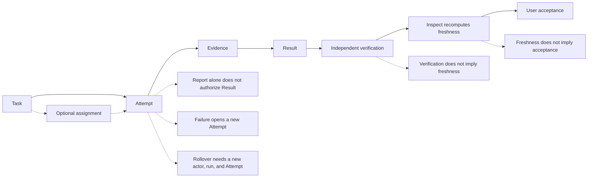
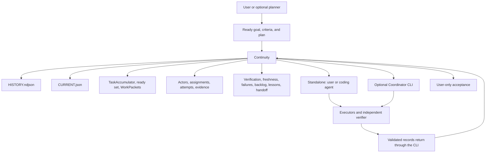

# Continuity

**Language:** **English** | [Russian](README.ru.md)

**Source-backed project continuity that survives chats, models, and executors.**

Continuity is a local Node.js product with three strictly separated layers:

1. **Project Memory Core** — append-only journal of goals, attempts, evidence, verification, and user acceptance.
2. **Continuity** — read/continuity plane: inspect, ready set, freshness, handoff.
3. **Coordinator** — optional execution runtime. It launches adapters and writes only through the Core CLI.

The journal is authoritative for what Continuity recorded. Live files, Git, and the user remain authoritative for the project. A historical PASS is not current truth.

## Which profile to download

| Profile | Use when | Contains | Coordinator required? |
| --- | --- | --- | --- |
| **Continuity Full** | You want memory and execution in one tree | Core + Continuity + Coordinator | No; Memory still works alone |
| **Continuity Memory** | You only need the journal and inspect/handoff | Core + Continuity + protocol | No |
| **Continuity Coordinator** | You already have a Memory CLI and want execution | Coordinator + protocol client + adapters | Connects to a Memory CLI |

Build zips from this tree:

```bash
node scripts/package-release.mjs dist
```

Download the matching zip. Verify `dist/SHA256SUMS` against the zip files. Install with:

```bash
node scripts/install.mjs --profile full --dest /absolute/path/to/dest --dry-run
node scripts/install.mjs --profile memory --dest /absolute/path/to/dest
node scripts/install.mjs --profile coordinator --dest /absolute/path/to/dest
```

Then run doctor:

```bash
node continuity/scripts/continuity.mjs --version
node continuity/scripts/coordinator.mjs --version
node continuity/scripts/continuity.mjs doctor
node continuity/scripts/coordinator.mjs doctor --root .
```

`--version` prints `continuity 2.0.0` and `continuity-coordinator 1.0.0`. `doctor` is read-only and does not create a store.

First scenario after `journal=uninitialized`: edit `continuity/assets/init-v3.template.json` so the goal and criterion are the user's, then `init --schema 3 --file ...`, `record task --class function`, attach command/test evidence, and keep acceptance as `record accept --as user`. Details are in First five minutes below.

Memory mode is autonomous: init, record, inspect, handoff, rebuild, and user-only acceptance. Coordinator mode needs a runtime adapter. The shipped live adapter is `local-process` (current Node.js). Only the user may accept or reject a result. A Coordinator cannot.

This product does not claim hosted-model execution, native discovery by every coding agent, a daemon or login task, or that a historical PASS is current.

## What Continuity is

Continuity is not the memory of a model. It is a local, source-backed record of project work: goals, constraints, tasks, attempts, failures, lessons, evidence, verification, freshness, and user acceptance.

You run `continuity/scripts/continuity.mjs` from the Git repository you care about. The helper stores data in that repository as `.continuity/HISTORY.ndjson` and `.continuity/CURRENT.json`. The Skill directory is code. The store is project data. Both survive the end of a chat.

The record keeps unsuccessful work as well as successful work. It does not promote an old note into current truth. Inspect recomputes freshness from live Git. Only the user may accept or reject a result.

Runtime requirements are Node.js 22 or 24 (`package.json` engines: `>=22 <25`) and Git. The Memory CLI does not launch models, agents, a planner, or a Coordinator. The optional Coordinator CLI is a separate foreground process; it never starts a daemon, network service, interview, or login task. Continuity may run local Git commands to read repository state.

The installable product tree is the `continuity/` directory plus the profile docs in this repository.

## The problem it solves

Long-running agent work loses facts that later chats need. Continuity records those facts without treating them as live authority.

| What goes wrong | What Continuity records | What it does not do |
| --- | --- | --- |
| A new chat does not know what already happened | `inspect` and `handoff` recover goals, tasks, attempts, failures, and next actions | Reconstruct unrecorded work |
| An agent retries a failed approach | Failures, lessons, and next actions stay in the append-only journal | Block a retry; it refuses to hide the failure |
| A historical PASS is treated as current | Freshness is recomputed from live Git and evidence at inspect time | Freeze a PASS across later edits |
| An executor report is treated as proof | `attempt.reported` is not authorizing evidence | Turn prose into a test result |
| Agents edit overlapping files | Assignments and path ownership exclude collisions from the ready set | Lock the filesystem |
| Reasons for decisions disappear | Decisions, constraints, and lessons are first-class records | Invent missing rationale |
| Context fills and unfinished attempts vanish | Context handoff keeps last step, actual state, failed hypotheses, and the exact next step | Continue the previous Attempt |
| Verification is mixed with user acceptance | Independent verification and `--as user` acceptance are separate writes | Let a Coordinator or verifier accept for the user |
| Backlog hides required work | Required criteria cannot be parked to skip them | Prevent parking optional work |
| A successor sees only the happy summary | Handoff includes failures, limitations, evidence, and next action | Transfer actor identity or close the old Attempt |

A Coordinator is an optional foreground runtime shipped as `continuity/scripts/coordinator.mjs`. Memory/Continuity does not start it. You run it explicitly. `--help` prints `usage: coordinator.mjs <doctor|plan|run|resume|status|cancel>`. There is no per-command `--help`.

## The five truth axes

These states are independent. None implies another.

**Execution → Evidence → Verification → Freshness → User acceptance**

| Axis | Meaning | Not the same as |
| --- | --- | --- |
| Execution | A Result records how the work executed (`succeeded`, `failed`, `partial`, and the other execution states) | Proof, freshness, or acceptance |
| Evidence | Authorizing evidence is a linked `command` or `test` observation with exit code `0` | An executor report |
| Verification | `record verify` from a different actor and run, with explicit `found` / `executed` / `passed` / `failed` counts | Freshness or acceptance |
| Freshness | `inspect` recomputes evidence age from live Git (HEAD and dirty worktree) | A stored verification outcome |
| User acceptance | Only `record accept --as user` or `record reject --as user --next "…"` | Any technical PASS |

An Attempt is one recorded try at a task. A Result is the recorded execution outcome of that Attempt. `record report` stores the actor's account of the Attempt; it is not evidence and it is not a Result.

Rules the helper enforces:

- `attempt.reported` is not authorizing evidence.
- Executor words are not proof. A report without `--exit-code` is stored as `agent_report` and cannot authorize success.
- Authorizing evidence is a linked `command` or `test` observation with exit code `0`.
- An independent verifier must differ from the executor and the Attempt owner. The verifier run must differ from the executor run when run ids exist.
- `record verify` also requires a persisted `agent.registered` record for that verifier. Different `--actor-id` and `--run-id` are necessary and not sufficient.
- Default identities `actor-<kind>` and `run-cli` are not independent and cannot self-verify.
- Successful verification does not set freshness.
- Fresh verification does not accept the result.
- Only the user may accept or reject a result. A Coordinator, executor, or verifier cannot.
- A historical PASS is not a current PASS.

## How it works

Continuity keeps three layers, and they are not equal.

1. **Live project reality.** Current files, Git, commands, tests, and the user's decisions. This remains authoritative for the project itself.
2. **Authoritative Continuity journal.** `.continuity/HISTORY.ndjson` is a bounded, append-only, hash-chained record of what Continuity actually wrote. The journal is authoritative for recorded history, not for whether the repository still matches that history.
3. **Rebuildable projection.** `.continuity/CURRENT.json` is a cache rebuilt from the journal. If it is missing, stale, or invalid, `inspect` stays read-only. `rebuild` is an explicit projection repair, not a query and not a source of new truth.

Old evidence can become stale when Git moves. An old PASS does not become a current PASS automatically. The projection can be rebuilt from the journal; the journal cannot be rebuilt from the projection.

Preferred writes use schema v3 recipes through `record`. Schema v1 still exists for older snapshot stores; its `checkpoint` command is not the v3 path. Schema v2 event stores exist in the helper, but this build does not render v2 inspect (`v2 inspect rendering is not available in this build`).

Useful derived objects, rebuilt from the journal:

- **TaskAccumulator** — tasks with priority, size, dependencies, ownership, attempts, evidence, freshness, and a recommended next action.
- **Ready set** — tasks that may be started now. It is computed at inspect time and is not a write.
- **WorkPacket** — one to four ready tasks with ownership, capabilities, checks, and a completion contract.
- **Build-First** — until a core `function` or `connector` Result has authorizing command/test evidence, unclassified, documentation, test-only, and cosmetic work stay out of the ready set.

`--as` selects actor kind (`user`, `coordinator`, `subagent`, `tool`, `migration`). It labels the writer. It does not launch a process. Omitting `--as` defaults to kind `coordinator`. That default is a label, not a running Coordinator.

The journal fails closed at 8 MiB. Inputs are bounded. Unknown fields and several recognizable secret or private-data patterns are rejected. Rejected writes leave the journal unchanged.



Failure appends a lesson, a next action, and a failure event. It does not rewrite earlier events. Context rollover ends the current actor session; the successor starts a new actor id, run id, and Attempt.

## System boundary

Direct use and coordinated use are alternative modes, not a required pipeline. Continuity does not launch the workers.



Continuity is not a process manager. An optional Coordinator may consume `inspect ready` and `inspect wave`, choose registered actors and available models, distribute validated WorkPackets, launch workers in the agent environment, and write back only through this helper. Graphify is an optional navigation adapter, not a source of truth. In this build the `graphify` command reports that Graphify support is not available.

## Standalone and coordinated modes

### Standalone mode

A user or coding agent talks to Continuity directly:

1. Run `doctor`. After a store exists, run `inspect` and `inspect ready --json`.
2. Supply a ready goal, criteria, and plan. Continuity does not interview or invent them.
3. `record task` with `--class function` or `--class connector`.
4. `record start`, attach authorizing command or test evidence, and `record result`.
5. Persist a verifier with `record --file` as `agent.registered`, run that verifier yourself, then `record verify` with a different actor and run.
6. Ask the user to `record accept` or `record reject`.
7. Read `handoff --task <task-id>` before the next chat.

No Coordinator, planner, or extra Skill is required for this loop. Packet and assignment records are optional in standalone use. They become necessary when you want the helper to enforce ownership and actor eligibility before work starts.

### Optional coordinated mode

When you run the optional Coordinator CLI, or when an agent environment already has a Coordinator, that Coordinator may:

- read `inspect ready` and `inspect wave`;
- choose from registered actors and available models;
- persist `agent.registered` records, WorkPackets, and assignments through the helper;
- launch executors and a different verifier in that environment;
- write events only through the validated CLI;
- integrate the result or start repair/replan.

It still cannot:

- edit `HISTORY.ndjson` by hand;
- accept work for the user;
- let a model or actor independently verify its own work;
- treat Graphify, planner output, or executor prose as authorizing evidence.

`project-memory.coordinator.v1` is the stable compatibility identifier for this protocol. It is not the product name.

There is no top-level `coordinate` command on the Memory CLI. Coordinator commands live on `coordinator.mjs`. `interview.offered` is always `false`.

## Installation

Continuity is distributed from [Altarnik88/continuity](https://github.com/Altarnik88/continuity) under the MIT License. It is not published to a package registry. The Skill has no runtime `npm install` step.

You can invoke the CLI from a clone, or copy the Skill directory into an agent-specific skills folder. Discovery paths differ between coding agents. This repository does not claim native integration with Codex, Claude, Cursor, or any other product.

### Direct CLI usage

Clone the repository, then invoke the helper by absolute path from the Git worktree Continuity should inspect:

```bash
git clone https://github.com/Altarnik88/continuity.git
cd continuity
node continuity/scripts/continuity.mjs --version
```

`--version` works without installing dependencies. It prints `continuity 2.0.0`.

From a different target repository:

```bash
node "/absolute/path/to/clone/continuity/scripts/continuity.mjs" doctor
```

`doctor` is read-only. On an uninitialized repository it reports `journal=uninitialized` and `projection=missing`, and does not create a store.

`inspect` requires an existing `HISTORY.ndjson`. Before `init`, bare `inspect` fails with `authoritative HISTORY.ndjson is missing`. `inspect --json` and `inspect ready --json` on an uninitialized store currently fail with `v2 inspect rendering is not available in this build`. Neither form creates a store.

Optional `--root` must name the target worktree's exact top level. The default store is `<target-repository>/.continuity`. `CONTINUITY_STORE_DIR` may select another repository-relative directory. Older `.codex/project-memory` locations are not read or imported automatically.

`continuity/scripts/project-memory.mjs` is a compatibility alias for the same CLI.

### Generic agent installation

Copy only `continuity/` and keep the destination directory name `continuity`. Consult the coding agent's own documentation for its skills directory and reload behavior.

PowerShell:

```powershell
$source = Resolve-Path '.\continuity'
$skillsRoot = Resolve-Path 'C:\path\documented-by-your-agent\skills'
$destination = Join-Path $skillsRoot 'continuity'
if (Test-Path -LiteralPath $destination) { throw "Destination already exists: $destination" }
Copy-Item -LiteralPath $source -Destination $destination -Recurse
node (Join-Path $destination 'scripts\continuity.mjs') --version
```

POSIX shell:

```bash
skills_root=/path/documented-by-your-agent/skills
test ! -e "$skills_root/continuity"
cp -R continuity "$skills_root/continuity"
node "$skills_root/continuity/scripts/continuity.mjs" --version
```

A successful copy proves the files and CLI are present. It does not prove the agent discovered the Skill.

`examples/AGENTS.snippet.md` is a starting instruction block you can adapt.

Update by replacing only the installed `continuity/` directory. Uninstall by removing only that directory. Do not delete `<repository>/.continuity` unless you intend to delete project continuity data.

## First five minutes

Run these from the Git repository Continuity should remember. Replace `/absolute/path/to/continuity` with the cloned or installed Skill directory.

```bash
node "/absolute/path/to/continuity/scripts/continuity.mjs" --version
node "/absolute/path/to/continuity/scripts/continuity.mjs" doctor
```

If `doctor` reports `journal=uninitialized`, review `continuity/assets/init-v3.template.json` and replace the example goal and criterion with the user's actual intent, then:

```bash
node "/absolute/path/to/continuity/scripts/continuity.mjs" init --schema 3 --file "/absolute/path/to/continuity/assets/init-v3.template.json"
node "/absolute/path/to/continuity/scripts/continuity.mjs" doctor
node "/absolute/path/to/continuity/scripts/continuity.mjs" inspect
```

`init` refuses an already initialized store. The bundled template creates a user-backed goal and one required criterion. It does not create tasks. After that template, `inspect ready --json` reports `plan.missing: ["taskAccumulator"]` until you record a task. If `plan.missing` is nonempty, stop assigning work. Continuity will not invent the missing requirements.

Record one core function task:

```bash
node "/absolute/path/to/continuity/scripts/continuity.mjs" record task --title "Name the work" --priority core --size S --class function --as coordinator --actor-id actor-writer --run-id run-plan-01
node "/absolute/path/to/continuity/scripts/continuity.mjs" inspect ready --json
```

`--as coordinator` here is only the writer kind. It does not start a Coordinator.

On a v3 store, inspect after the template looks like this:

```text
GOAL goal-final Keep truthful project continuity
CRITERIA criterion-honest
CONFIRMED none
UNVERIFIED none
STALE none
FAILURES none
REJECTED none
BLOCKED none
CONFLICTS none
ACTORS user:actor-user
NEXT none
PROHIBITED none
```

`inspect ready` without `--json` prints a short coordination view. `inspect wave` always prints JSON.

## Core workflow

Use this loop for nontrivial implementation. Read-only, trivial, no-op, or inconclusive work may inspect and should not write.

`--as` is actor kind. `--actor-id` and `--run-id` identify the writer. `record assign --assignee` names the owned actor, which may differ from the writer. Stable ids look like `actor-writer` and `run-plan-01`.

A core task without `--class function` or `--class connector` is stored as `unclassified` and is not ready before the Build-First gate. Omitting `--class` does not fail the write; `inspect wave` excludes it as `unclassified-task-class`.

Standalone execution can start after `record task`:

```bash
node "/absolute/path/to/continuity/scripts/continuity.mjs" record start --task <task-id> --approach "One sentence" --as subagent --actor-id actor-exec-01 --run-id run-exec-01
node "/absolute/path/to/continuity/scripts/continuity.mjs" record report --execution partial --as subagent --actor-id actor-exec-01 --run-id run-exec-01
node "/absolute/path/to/continuity/scripts/continuity.mjs" record evidence --expected "check passes" --actual "exit 0" --kind command --exit-code 0 --as subagent --actor-id actor-exec-01 --run-id run-exec-01
node "/absolute/path/to/continuity/scripts/continuity.mjs" record result --expected "check passes" --actual "what happened" --as subagent --actor-id actor-exec-01 --run-id run-exec-01
```

`record report` does not authorize a Result. Evidence without `--exit-code` is an `agent_report` and also cannot authorize success.

To assign work or record independent verification, persist actors first. There is no `record register` recipe. Use `record --file` with `agent.registered`:

```json
{
  "eventType": "agent.registered",
  "occurredAt": "2026-08-21T00:00:00.000Z",
  "actor": { "kind": "coordinator", "id": "actor-writer", "role": "coordinator", "runId": "run-plan-01" },
  "subject": { "type": "agent", "id": "actor-exec-01" },
  "supersedes": [],
  "contradicts": [],
  "evidenceRefs": [],
  "sensitivity": "internal",
  "payload": {
    "agent": {
      "actorId": "actor-exec-01",
      "providerFamily": "local",
      "modelFamily": "small",
      "capabilityProfiles": ["implementation"],
      "costTier": "lowest",
      "speedTier": "fast",
      "trustTier": "standard",
      "calibrationStatus": "calibrated",
      "kind": "subagent"
    }
  }
}
```

Register the executor and a different verifier, then:

```bash
node "/absolute/path/to/continuity/scripts/continuity.mjs" record --file executor.json
node "/absolute/path/to/continuity/scripts/continuity.mjs" record --file verifier.json
node "/absolute/path/to/continuity/scripts/continuity.mjs" inspect wave --json
node "/absolute/path/to/continuity/scripts/continuity.mjs" record packet --task <task-id> --as coordinator --actor-id actor-writer --run-id run-plan-01
node "/absolute/path/to/continuity/scripts/continuity.mjs" record assign --task <task-id> --assignee actor-exec-01 --as coordinator --actor-id actor-writer --run-id run-plan-01
node "/absolute/path/to/continuity/scripts/continuity.mjs" record verify --as subagent --actor-id actor-verify-01 --run-id run-verify-01 --result <result-id> --found 1 --executed 1 --passed 1 --failed 0
node "/absolute/path/to/continuity/scripts/continuity.mjs" record accept --as user --result <result-id>
```

`record assign` needs a matching persisted packet and a registered assignee. `record verify` needs a registered verifier whose actor id and run id differ from the executor and Attempt owner.

If the attempt fails:

```bash
node "/absolute/path/to/continuity/scripts/continuity.mjs" record fail --why "what broke" --impact "what is stuck" --next "different next step" --as subagent --actor-id actor-exec-01 --run-id run-exec-01
```

That appends a lesson, a next action, and a failure. Retry with a new `record start` and a changed approach. Do not rewrite the failed Attempt.

If context is filling:

```bash
node "/absolute/path/to/continuity/scripts/continuity.mjs" record context --next "Exact next step" --as subagent --actor-id actor-exec-01 --run-id run-exec-01
node "/absolute/path/to/continuity/scripts/continuity.mjs" handoff --task <task-id>
```

`handoff` is read-only and requires a task. The successor uses a new `--actor-id`, `--run-id`, and Attempt. After a partial handoff, `record start` needs explicit `--task`. Stop assigning new packets around 65% context used when the environment reports a trustworthy ratio; keep the rest for a focused check or handoff.

User rejection also requires a next step:

```bash
node "/absolute/path/to/continuity/scripts/continuity.mjs" record reject --as user --result <result-id> --next "Different next step"
```

After any write, run `validate` and `inspect`. Do not edit journal or projection files by hand. Follow [security-workflow.md](continuity/references/security-workflow.md) for locks and recovery. Store writes are refused from linked worktrees; mutate from the primary worktree.

Top-level commands:

```text
usage: continuity.mjs <init|record|inspect|history|handoff|validate|doctor|rebuild|migrate|graphify>
```

`--help` prints that usage plus the default store path. There is no `inspect --help` or `record --help`. v3 `record` recipes are `task`, `start`, `evidence`, `result`, `fail`, `accept`, `reject`, `assign`, `packet`, `release`, `report`, `verify`, `context`, and `backlog`. Raw drafts still go through `record --file` or `record --stdin`.

`migrate` and `graphify` appear in the usage string. In this build they report that migration and Graphify support are not available and exit without writing.

## Real-world use cases

| Situation | What usually goes wrong | How Continuity helps | What it does not automate |
| --- | --- | --- | --- |
| Long-running feature across many chats | The next chat repeats discovery | `inspect` and `handoff` recover goal, attempts, evidence, and next action | Resume the previous actor session |
| Brownfield repository with existing WIP | Agents treat dirty files as a blank slate | `doctor` and inspect compare recorded workspace with live Git | Invent a plan for unrecorded WIP |
| Multi-agent parallel implementation | Two agents take the same files | Ready set and assignments exclude overlapping ownership | Launch the agents |
| Large refactor with overlapping file ownership | Path collisions show up after the damage | Ownership is checked again at `record assign` | Merge conflicting edits |
| Security-sensitive repair | A report is treated as a security PASS | Isolation rules, independent verification, and user-only acceptance stay separate | Scan for vulnerabilities |
| Database or schema migration | A failed rollback is retried silently | Failures and forbidden approaches remain in the journal | Run the migration |
| Failed approach that must not be repeated | The next executor only sees the last summary | `record fail` stores symptom, impact, lesson, and next step | Stop an operator from ignoring that record |
| Context window approaching its limit | Partial work disappears with the chat | `record context` plus read-only `handoff` keep the exact next step | Measure tokens by itself |
| Replacement of an executor or model | The successor inherits an open Attempt | Replacement requires a new actor, run, and Attempt | Pick the replacement model |
| Independent verification before release | The implementer verifies their own work | Same actor or same run is a no-effect rejection | Execute the tests |
| User acceptance after technical verification | A Coordinator marks the work done | Only `--as user` changes acceptance | Accept on the user's behalf |
| Returning to an abandoned project weeks later | Historical PASS is trusted against a moved HEAD | Inspect recomputes freshness; stale evidence is visible | Rebase, re-run, or restore backups |

A realistic failure, not a happy-path rewrite: a migration agent records the failed rollback hypothesis and the affected paths. The successor reads that history in the handoff, opens a new Attempt, and tries a different approach instead of repeating the same rollback.

## Where Continuity earns its keep

Continuity is useful when the cost of forgetting is higher than the cost of recording a few bounded facts: long-running repository work, more than one coding agent on the same repo, brownfield Git, migrations and security repairs that must keep failure history, and any task that must distinguish “the test passed just now” from “the user accepted this.”

The journal preserves what was asked, what was tried, which approaches failed, what was proven, how fresh that proof is, what is still blocked, what the user has not accepted, and what the next actor should do. It is not a chat archive.

## When not to use it

Do not use Continuity as:

- a one-off trivial edit log;
- a secrets or credentials store;
- a dump of raw logs, diffs, or command output;
- a Git replacement;
- an issue tracker;
- a backup system;
- a tamper-proof audit database;
- an automatic process manager;
- a model router;
- a daemon or network orchestration service;
- a universal native integration with every coding agent;
- automatic proof of correctness.

If the work is a single obvious edit, run the edit. If the work is a long agent session that will be continued by someone who was not in the room, record Continuity.

## Repository structure

This worktree contains 132 files. The installable Skill is `continuity/` (61 files). Root `tests/` and `scripts/` are development and release tooling. GitHub shows `README.md` by default; [README.ru.md](README.ru.md) is the Russian version.

```text
.
├── continuity/                 # installable Skill (copy this directory)
│   ├── SKILL.md                # Skill instructions and frontmatter
│   ├── assets/                 # init, snapshot, and coordinator.config.json
│   ├── references/             # canonical protocol docs and JSON Schemas
│   └── scripts/
│       ├── continuity.mjs      # Memory/Continuity CLI
│       ├── coordinator.mjs     # optional Coordinator CLI
│       ├── project-memory.mjs  # compatibility alias for continuity.mjs
│       ├── smokes/             # profile install smokes
│       └── lib/
│           ├── core/           # journal, recipes, inspect, store
│           │   └── coordination/
│           ├── continuity/     # v2 inspect adapter (stub in this build)
│           ├── coordinator/    # foreground runtime, adapters, run-state
│           ├── protocol/       # shared ports and client
│           ├── graphify/       # optional Graphify adapter (stub in this build)
│           └── migration/      # explicit migration adapter (stub in this build)
├── tests/                      # repository tests; not needed after install
├── scripts/                    # validate, install, package-release
├── examples/                   # snapshots, AGENTS snippet, coordinator.config.json
├── .github/workflows/          # CI
├── ADAPTERS.md
├── ARCHITECTURE.md
├── CHANGELOG.md
├── COORDINATOR.md
├── INSTALL.md
├── MIGRATION.md
├── PROTOCOL.md
├── README.md
├── README.ru.md
├── RELEASE.md
├── SECURITY.md
├── LICENSE
├── package.json
└── package-lock.json
```

| Path | What it is | Needed after install? | Kind |
| --- | --- | --- | --- |
| `continuity/` | Complete distributable Skill | Yes | runtime |
| `continuity/SKILL.md` | Installed Skill instructions (`name: continuity`) | Yes | runtime docs |
| `continuity/assets/` | init/snapshot templates and `coordinator.config.json` | Yes, for `init` and Coordinator | runtime templates |
| `continuity/references/` | Protocol guides and portable JSON Schemas | Yes, as references | runtime docs |
| `continuity/scripts/continuity.mjs` | Canonical Memory/Continuity CLI | Yes | runtime |
| `continuity/scripts/coordinator.mjs` | Optional Coordinator CLI | Yes, for Coordinator/Full | runtime |
| `continuity/scripts/project-memory.mjs` | Compatibility alias that imports `continuity.mjs` | Only for old invocation paths | runtime alias |
| `continuity/scripts/lib/core/` | Domain, journal, recipes, inspect, workspace, store | Yes | runtime |
| `continuity/scripts/lib/core/coordination/` | TaskAccumulator, ready set, packets, registry, persist policy | Yes | runtime |
| `continuity/scripts/lib/coordinator/` | Coordinator engine, config, adapters, run-state | Yes, for Coordinator/Full | runtime |
| `continuity/scripts/lib/protocol/` | Shared protocol ports and CLI client | Yes | runtime |
| `continuity/scripts/lib/continuity/` | v2 inspect rendering entry | Present; reports unavailable in this build | runtime stub |
| `continuity/scripts/lib/graphify/` | Graphify command entry | Present; reports unavailable in this build | runtime stub |
| `continuity/scripts/lib/migration/` | Migration command entry | Present; reports unavailable in this build | runtime stub |
| `tests/` | Core, protocol, coordinator, package, and helper tests | No | tests |
| `scripts/` | validate, install, package-release, forward acceptance | No | release tooling |
| `.github/workflows/` | CI matrix | No | release tooling |
| `examples/` | Snapshot fixtures, `AGENTS.snippet.md`, `coordinator.config.json` | Optional | examples |
| Product docs, `LICENSE`, `package.json` | ARCHITECTURE, PROTOCOL, INSTALL, COORDINATOR, ADAPTERS, MIGRATION, RELEASE, CHANGELOG, README, SECURITY | LICENSE travels with a Skill copy | docs / metadata |

`npm pack --dry-run` includes 79 files: the Skill, examples, license, product docs, both README files, and `package.json`. That tarball is not the installation unit. Installation copies `continuity/` or a profile zip.

<details>
<summary>Worktree files (132)</summary>

```text
.gitattributes
.github/workflows/ci.yml
.gitignore
ADAPTERS.md
ARCHITECTURE.md
CHANGELOG.md
COORDINATOR.md
INSTALL.md
LICENSE
MIGRATION.md
PROTOCOL.md
README.md
README.ru.md
RELEASE.md
SECURITY.md
continuity/SKILL.md
continuity/assets/coordinator.config.json
continuity/assets/init-v2.template.json
continuity/assets/init-v3.template.json
continuity/assets/snapshot-v1.template.json
continuity/references/context-rollover.md
continuity/references/coordination.md
continuity/references/inspect-v1.schema.json
continuity/references/installation.md
continuity/references/project-execution.md
continuity/references/projection-v2.schema.json
continuity/references/scheduling.md
continuity/references/schema.md
continuity/references/security-workflow.md
continuity/references/snapshot-v1.schema.json
continuity/references/task-accumulator.md
continuity/references/v2-contract.schema.json
continuity/references/verification-swarm.md
continuity/scripts/continuity.mjs
continuity/scripts/coordinator.mjs
continuity/scripts/lib/continuity/index.mjs
continuity/scripts/lib/coordinator/adapters/fake.mjs
continuity/scripts/lib/coordinator/adapters/index.mjs
continuity/scripts/lib/coordinator/adapters/local-process.mjs
continuity/scripts/lib/coordinator/adapters/local-worker.mjs
continuity/scripts/lib/coordinator/cli.mjs
continuity/scripts/lib/coordinator/config.mjs
continuity/scripts/lib/coordinator/engine.mjs
continuity/scripts/lib/coordinator/index.mjs
continuity/scripts/lib/coordinator/run-state.mjs
continuity/scripts/lib/core/cli-v3.mjs
continuity/scripts/lib/core/cli.mjs
continuity/scripts/lib/core/coordination/accumulator.mjs
continuity/scripts/lib/core/coordination/contract.mjs
continuity/scripts/lib/core/coordination/index.mjs
continuity/scripts/lib/core/coordination/persist-policy.mjs
continuity/scripts/lib/core/coordination/registry.mjs
continuity/scripts/lib/core/coordination/schedule.mjs
continuity/scripts/lib/core/domain-v2.mjs
continuity/scripts/lib/core/domain-v3.mjs
continuity/scripts/lib/core/input-v3.mjs
continuity/scripts/lib/core/inspect-v3.mjs
continuity/scripts/lib/core/journal-v2.mjs
continuity/scripts/lib/core/journal-v3.mjs
continuity/scripts/lib/core/legacy-v1.mjs
continuity/scripts/lib/core/recipes-v3.mjs
continuity/scripts/lib/core/store.mjs
continuity/scripts/lib/core/workspace-v3.mjs
continuity/scripts/lib/graphify/index.mjs
continuity/scripts/lib/migration/index.mjs
continuity/scripts/lib/protocol/adapter.mjs
continuity/scripts/lib/protocol/client.mjs
continuity/scripts/lib/protocol/compatibility.mjs
continuity/scripts/lib/protocol/index.mjs
continuity/scripts/lib/protocol/ports.mjs
continuity/scripts/lib/protocol/secrets.mjs
continuity/scripts/lib/protocol/validate.mjs
continuity/scripts/project-memory.mjs
continuity/scripts/smokes/coordinator.mjs
continuity/scripts/smokes/full.mjs
continuity/scripts/smokes/memory.mjs
examples/AGENTS.snippet.md
examples/coordinator.config.json
examples/snapshot.minimal.json
examples/snapshot.source-backed.json
examples/source-anchor.md
package-lock.json
package.json
scripts/install.mjs
scripts/package-inventory.mjs
scripts/package-release.mjs
scripts/release-profiles.mjs
scripts/test-continuity.mjs
scripts/test-coordinator.mjs
scripts/test-forward-acceptance.mjs
scripts/test-package-install.mjs
scripts/test-package.mjs
scripts/test-protocol.mjs
scripts/test-release.mjs
scripts/test-validate-package.mjs
scripts/validate-package.mjs
scripts/zip-store.mjs
tests/coordinator/runtime.test.mjs
tests/coordinator/security.test.mjs
tests/core/actor-identity-cli.test.mjs
tests/core/adverse-retry.test.mjs
tests/core/all-event-paths.test.mjs
tests/core/append-freshness-authority.test.mjs
tests/core/atomic-recipes.test.mjs
tests/core/bindings.test.mjs
tests/core/cli-contract.test.mjs
tests/core/continuity-runtime.test.mjs
tests/core/contracts.test.mjs
tests/core/coordination.test.mjs
tests/core/criterion-revision-owner.test.mjs
tests/core/duplicate-event.test.mjs
tests/core/failure-schema-parity.test.mjs
tests/core/final-goal-authority.test.mjs
tests/core/integration-seams.test.mjs
tests/core/journal-cli.test.mjs
tests/core/migration-invariants.test.mjs
tests/core/projection-order.test.mjs
tests/core/required-goal-task.test.mjs
tests/core/schemas.test.mjs
tests/core/security.test.mjs
tests/core/stdin-bound.test.mjs
tests/core/suite-aggregator.test.mjs
tests/core/task-revised.test.mjs
tests/core/transitions.test.mjs
tests/core/truth-closure.test.mjs
tests/core/v3-crash-concurrent.test.mjs
tests/core/v3-e2e.test.mjs
tests/core/workspace-fingerprint.test.mjs
tests/helpers/repository.mjs
tests/helpers/suite-aggregator.mjs
tests/helpers/v2-contract-fixture.mjs
tests/protocol/protocol.test.mjs
```

</details>

## Security model

Continuity is local and fail-closed. It is not a security product.

What it does:

- runs locally with Node.js and Git; it does not open a network client for normal use;
- keeps the store inside the target repository, as regular files with bounded size;
- hash-chains `HISTORY.ndjson` so readers can detect a broken chain;
- rejects path traversal, reparse/alias escapes, and several recognizable secret or private-data patterns;
- refuses silent journal edits: writes go through the helper;
- refuses automatic import of a legacy `.codex/project-memory` store;
- refuses automatic merge of divergent journals;
- treats Graphify receipts as non-authorizing when present;
- does not start a daemon, interview, or automatic model installer.

What it does not do:

- it is not a secret scanner, privacy classifier, DLP, or access-control system;
- a successful `validate`, dry-run, or lint is not proof that content is safe;
- an actor who can rewrite both the repository and the checker can rebuild the hash chain;
- `CURRENT.json` is not a backup.

Do not record credentials, tokens, cookies, connection strings, `.env` assignments, personal data, customer payloads, raw database rows, raw diffs, logs, stack dumps, command output, or absolute local paths. Report vulnerabilities privately through [Continuity security advisories](https://github.com/Altarnik88/continuity/security/advisories/new). Do not attach a real Continuity store to a public issue.

## Compatibility and legacy identifiers

The product name is Continuity.

`project-memory.coordinator.v1` remains the Coordinator protocol identifier so existing consumers do not have to rename the contract. It is not a Skill, not a dependency, and not the product.

`continuity/scripts/project-memory.mjs` is a compatibility alias that loads `continuity.mjs`. New docs and invocations should use `continuity.mjs`.

The default store is `.continuity`. A legacy `.codex/project-memory` directory may be discovered as metadata for an operator-controlled migration. This build does not read those records automatically, and `migrate` reports that migration support is not available.

## Current limitations

- Preferred new stores are schema v3. Schema v1 snapshot stores and schema v2 event stores still exist in the helper.
- v2 inspect rendering is not available in this build.
- `migrate` and `graphify` are present in the CLI surface and unavailable in this build.
- On a v3 store, `history` currently renders the inspect view; it is not a tailed event listing. `--tail` applies to v1/v2 history.
- `handoff` requires a task. It is not a substitute for `record context`.
- `inspect` does not initialize a store. Use `doctor` on an empty repository.
- There is no per-command `--help` for `inspect`, `record`, or Coordinator commands.
- There is no `record register` recipe. Actors used for assignment or verification must be persisted with `record --file` as `agent.registered`.
- Continuity `--version` prints `2.0.0`; Coordinator `--version` prints `continuity-coordinator 1.0.0`; `package.json` version is `1.0.0`.
- Node engines are `>=22 <25`. “Node.js 22+” in Skill text still means a supported Node 22 or 24 runtime.
- The journal is bounded (8 MiB) and linear. There is no automatic rollover, archive, upgrade, or journal merge.
- Multi-event recipes preflight, then append sequentially. That is not a single transactional append.
- Ready-set scheduling is deterministic, but Continuity does not launch the scheduled actors.
- Pattern guards are best-effort. They will miss encoded secrets and novel PII.
- This repository does not claim native discovery by every coding agent.

## Development and verification

Local `npm run validate` on this three-layer worktree:

```text
package validation: ok (worktree 132 files; skill 61; repo-only 0; metadata 71; npm-pack 79 files, not the standalone Skill artifact)
```

`npm run check` is:

```bash
npm run validate && npm test && npm run test:package && npm run test:forward && npm run test:release
```

GitHub Actions CI uses `ubuntu-latest`, `windows-latest`, and `macos-latest` with Node 22 and 24, exactly one pinned checkout, `timeout-minutes: 15`, `npm ci --ignore-scripts`, named protocol/coordinator lanes, Combined check (`npm run check`), profile smokes, and `npm run audit:dev`. Combined check executes the local aggregate rather than only mentioning it.

Local helper probes:

- `node continuity/scripts/continuity.mjs --version` → `continuity 2.0.0`
- `node continuity/scripts/coordinator.mjs --version` → `continuity-coordinator 1.0.0`
- `doctor` on an empty Git worktree → `journal=uninitialized`
- `coordinator.mjs doctor --root .` → `daemon=false`, `adapter=local-process`, `adapter-class=live`
- `init --schema 3 --file continuity/assets/init-v3.template.json` → `continuity v3 initialized`
- `inspect`, `inspect ready --json`, `inspect wave --json`, and `record task --class function` behave as documented above
- `graphify observe` → Graphify support is not available (exit 4)
- `migrate --to 2` → migration support is not available (exit 3)

Contributor commands:

```bash
npm ci --ignore-scripts
npm run check
npm run audit:dev
```

## FAQ

**Why does the repository still contain `project-memory`?**

Because `project-memory.coordinator.v1` is the stable protocol id, and `scripts/project-memory.mjs` is a compatibility alias. The product is Continuity. Those strings are not a second Skill and not a required Coordinator.

**Does Continuity require a Coordinator?**

No. Standalone Memory/Continuity is a complete product. Coordinator is an optional shipped CLI (`continuity/scripts/coordinator.mjs`). Memory does not start it.

**Does Continuity require a planner?**

No. Supply a ready goal, criteria, and plan yourself, or let any planning tool produce that input. Missing input stays `plan.missing`.

**Why is `--as coordinator` in the standalone examples?**

`--as` is actor kind, not a process launcher. The helper defaults to kind `coordinator` when `--as` is omitted. That does not start a Coordinator.

**Why did `record assign` or `record verify` fail with an unregistered actor?**

Assignment and independent verification require a persisted `agent.registered` record for that actor. Different `--actor-id` values are not enough by themselves.

**Can I point my agent at this GitHub repository and expect native discovery?**

Not from this README. Copy `continuity/` into the skills directory your agent documents, or invoke the CLI by path.

**Is the journal tamper-proof?**

No. Hash-chaining detects accidental or casual breakage. It does not stop someone who can rewrite the files and the checker.

**Can I merge two Continuity stores?**

No. Do not use a union merge driver on `HISTORY.ndjson`. Linked worktrees may inspect; they must not diverge writers.

**What if `CURRENT.json` is missing?**

The journal remains authoritative for recorded events. `inspect` stays read-only. Use `rebuild` only as an intentional projection repair on a v3 store.

**Why did `inspect` fail before `init`?**

Because there is no journal yet. `doctor` is the uninitialized probe. `inspect` does not create `HISTORY.ndjson`.

**Why are the CLI and package versions different?**

Continuity `--version` prints `continuity 2.0.0`. Coordinator `--version` prints `continuity-coordinator 1.0.0`. `package.json` version is `1.0.0`. They are independent strings.

## License

[MIT License](LICENSE). Copyright (c) 2026 Altarnik88.

## Start using Continuity

1. Clone [Altarnik88/continuity](https://github.com/Altarnik88/continuity).
2. Call `continuity/scripts/continuity.mjs` by absolute path, or copy `continuity/` into your agent's skills directory.
3. From the target Git repository, run `--version` and `doctor`.
4. If the store is uninitialized, edit the v3 template and run `init --schema 3 --file .../init-v3.template.json`.
5. Record a `function` or `connector` task, attach command/test evidence, verify with a registered different actor and run, and let only the user accept.

Then read:

- [Install](INSTALL.md)
- [Architecture](ARCHITECTURE.md)
- [Coordinator](COORDINATOR.md)
- [Adapters](ADAPTERS.md)
- [Protocol](PROTOCOL.md)
- [Migration](MIGRATION.md)
- [Release](RELEASE.md)
- [Skill instructions](continuity/SKILL.md)
- [Installation](continuity/references/installation.md)
- [Project execution](continuity/references/project-execution.md)
- [Coordinator contract](continuity/references/coordination.md)
- [Task accumulation](continuity/references/task-accumulator.md)
- [Scheduling](continuity/references/scheduling.md)
- [Context rollover](continuity/references/context-rollover.md)
- [Independent verification](continuity/references/verification-swarm.md)
- [Snapshot schema](continuity/references/schema.md)
- [Security workflow](continuity/references/security-workflow.md)
- [SECURITY.md](SECURITY.md)
