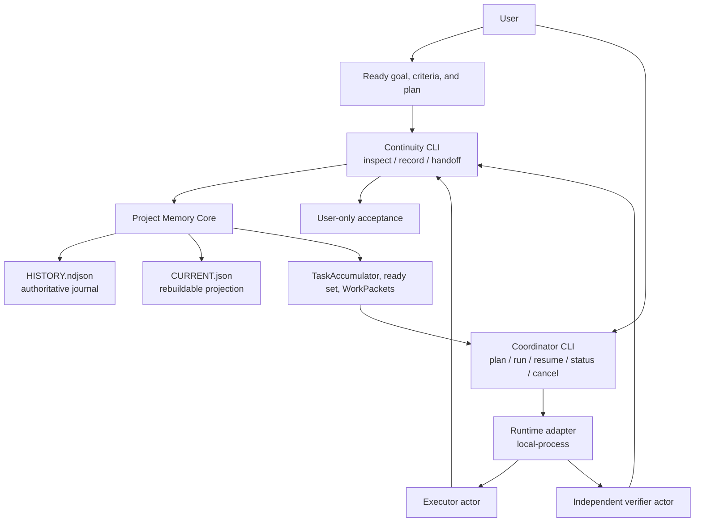
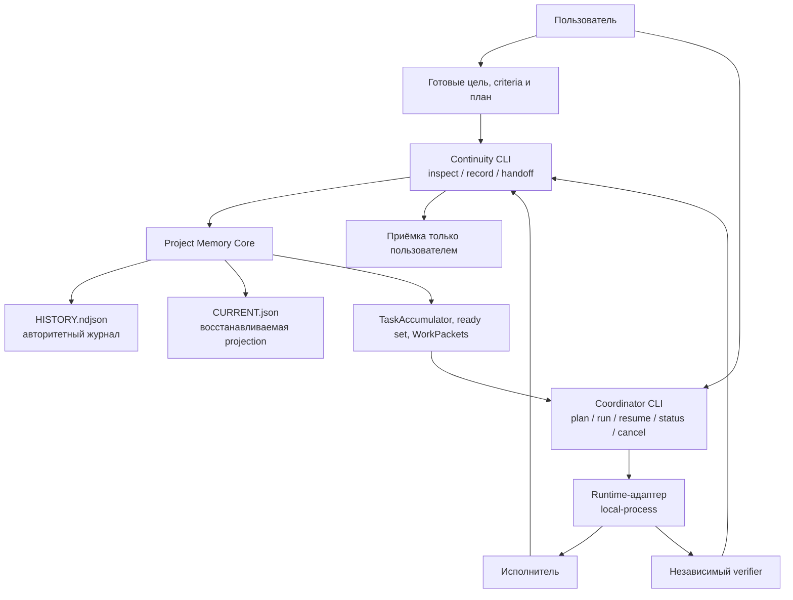

<a id="lang-en"></a>

# Continuity

<p align="center"><strong>English</strong> · <a href="#lang-ru">Русский</a></p>

**A local control plane for long-running coding-agent work: memory that survives chats, and explicit management of executors and verifiers.**

Continuity is a downloadable Node.js product for a Git repository. It does two jobs that coding sessions usually mix together and then lose:

1. **Remember the project truth** — goals, failed attempts, evidence, independent verification, freshness, and whether the *user* accepted the result.
2. **Manage agents as a swarm, not as one chat** — ready work, ownership isolation, WorkPackets, executor launch, independent verification, restart, and stop. Words from an executor are never treated as proof.

You download it when a later chat, a different model, or a replacement executor must continue without guessing — and when more than one actor must work on the same repository without colliding or marking the work done for you.

Runtime: Node.js 22 or 24 (`package.json` engines: `>=22 <25`) and Git. MIT License. Distributed from [Altarnik88/continuity](https://github.com/Altarnik88/continuity), not from a package registry.

## Why download and use this

Long agent work fails in two independent ways.

**Memory failure.** A new chat does not know the goal, the failed approaches, the last evidence, or the exact next step. Historical PASS is trusted against a moved Git HEAD. The implementer “verifies” their own work. Someone other than the user marks the feature accepted.

**Management failure.** Two agents edit the same files. Ready work is guessed instead of derived. A Coordinator process is implied but never actually run. An executor report is treated as a test result. A replacement actor continues the previous Attempt. Required criteria disappear into a backlog.

Continuity exists so those failures stay visible and bounded:

| You need | You download Continuity because |
| --- | --- |
| Work that spans many chats or models | `inspect` and `handoff` recover recorded truth without inventing missing history |
| Failed approaches that must not be silently retried | Failures, lessons, and forbidden approaches stay in an append-only journal |
| Several agents on one repository | Ready set, path ownership, and assignments exclude overlapping work |
| Proof vs talk | Authorizing evidence is a `command` or `test` with exit code `0`; reports are not evidence |
| Independent check | A different actor and run must verify; self-verify is a no-effect rejection |
| Human authority | Only `record accept --as user` or `record reject --as user` changes acceptance |
| Actual execution, not a protocol essay | Optional Coordinator CLI launches adapters in the foreground and writes back only through the Memory CLI |

Do **not** download it as a Git replacement, issue tracker, secret store, hosted-model marketplace, daemon, or automatic proof of correctness. If the edit is one obvious change, just make the edit. If the next actor was not in the room, use Continuity.

## What Continuity is

Continuity is not the memory of a model and not a hidden agent runner. It is three strictly separated layers in one repository:

| Layer | Job | Not its job |
| --- | --- | --- |
| **Project Memory Core** | Own long-term recorded truth | Choose a model, launch a process, accept work for the user |
| **Continuity** | Read/continuity plane for the next chat or actor | Become Coordinator or start executors |
| **Coordinator** | Execution plane: packets, adapters, waves, resume | Edit the journal, treat reports as proof, accept for the user |

You talk to Core and Continuity through:

```text
usage: continuity.mjs <init|record|inspect|history|handoff|validate|doctor|rebuild|migrate>
```

You talk to agent management through a **separate** foreground CLI:

```text
usage: coordinator.mjs <doctor|plan|run|resume|status|cancel>
```

Memory never starts Coordinator. Coordinator never starts as a daemon, watcher, login task, or network service. Both CLIs are explicit.

The Skill/code lives in `continuity/`. Project data lives in the target Git repository as `.continuity/HISTORY.ndjson` (authoritative journal) and `.continuity/CURRENT.json` (rebuildable projection). Coordinator run state, if you use it, lives in `.continuity/coordinator/runs`. Code and project data both survive the end of a chat.

## Project contour

These are not a required pipeline. Direct Memory use and coordinated execution are alternative modes.



Write path: every durable Continuity event goes through `continuity/scripts/continuity.mjs`. Coordinator may only spawn that CLI (or an equivalent validated Core API). It must not open `HISTORY.ndjson` or `CURRENT.json` itself.

Read path: `inspect`, `inspect ready`, `inspect wave`, `handoff`, `doctor`, `validate`, and `history` do not repair the projection. `rebuild` is an explicit operator write.

## The three layers

### 1. Project Memory Core

Core is the only owner of long-term recorded truth.

It stores and validates:

- goals and required criteria;
- TaskAccumulator (priority, size, dependencies, ownership, next action);
- actors and run identity;
- Attempts and Results;
- evidence and provenance;
- independent verification counts;
- freshness inputs;
- user acceptance (pending until the user writes);
- failures, blockers, conflicts, lessons;
- decisions and rationale;
- assignments and ownership records;
- context handoff;
- append-only hash-chained journal;
- deterministic rebuildable projection;
- rejected-write no-effect.

`HISTORY.ndjson` is authoritative for what was written. `CURRENT.json` is a cache rebuilt from the journal, not a second source of truth. The journal fails closed at 8 MiB. Unknown fields and recognizable secret patterns are rejected. A rejected write leaves the store unchanged.

Core does not pick a model, balance load, launch an agent, manage OS processes, declare user acceptance, or turn executor prose into evidence.

### 2. Continuity

Continuity is the read/continuity plane between the journal and the next participant.

It is responsible for:

- startup orientation for a new chat (`doctor`, `inspect`);
- deterministic inspect of goals, criteria, failures, and next actions;
- ready state (`inspect ready`) and wave view (`inspect wave`);
- bounded handoff (`handoff --task`);
- live Git / worktree / evidence drift (freshness recomputed at inspect);
- closure-preserving filtering;
- schema and semantic validation before emission;
- read-only behavior with no hidden mutation.

Continuity does not launch agents and does not become Coordinator.

### 3. Coordinator

Coordinator is the execution plane. It is optional. Memory works without it. You run it only when you want Continuity to **drive actors**, not only remember them.

It is responsible for:

- consuming the derived dependency graph and ready set;
- building WorkPackets with allowed/forbidden paths, capabilities, and acceptance criteria;
- capability-based actor selection;
- adaptive waves and slot limits;
- ownership isolation (no parallel packets on overlapping paths);
- launching executors through a vendor-neutral runtime adapter;
- context rollover (new actor id, run id, and Attempt — never continue the old Attempt);
- repair / replan stop conditions;
- integrating structured reports;
- launching a **different** verifier actor;
- stopping after the wave is done, with user acceptance still pending;
- persisting CoordinatorRun state so `resume` does not close someone else's Attempt.

Coordinator cannot:

- accept work for the user;
- treat an executor report as proof;
- let an actor verify its own Result;
- hide a required Criterion in backlog;
- continue an Attempt under a new actor identity;
- silently fall back to an unknown or paid provider.

Stable protocol identifier: `project-memory.coordinator.v1`. That string is a compatibility id, not the product name.

## Agent management

This is the part Memory alone does not do. Memory can record that an actor exists. Coordinator actually assigns, launches, waits, and records the attempt through the Memory CLI.

### Commands

```bash
node continuity/scripts/coordinator.mjs --help
node continuity/scripts/coordinator.mjs --version
node continuity/scripts/coordinator.mjs doctor --root <repo>
node continuity/scripts/coordinator.mjs plan --root <repo>
node continuity/scripts/coordinator.mjs run --root <repo> --config <file>
node continuity/scripts/coordinator.mjs resume --run <id>
node continuity/scripts/coordinator.mjs status --run <id>
node continuity/scripts/coordinator.mjs cancel --run <id>
```

`--version` prints `continuity-coordinator 1.0.0`. There is no per-command `--help`. Other flags: `--root`, `--config`, `--run`, `--adapter`, `--slots` (1..8), `--json`. Default config is `continuity/assets/coordinator.config.json`.

`doctor` reports `daemon=false`. If `liveProofRequired` is true (the default), a test-only `fake` adapter is refused.

### What a WorkPacket carries

Each packet for an actor includes wave id, packet id, actor/run identity, goal, dependencies, allowed and forbidden paths, required capabilities, risk ceiling, context budget, acceptance criteria, focused checks, known failures, prohibited approaches, and the structured report format.

A report is stored. It is still not authorizing evidence. Coordinator must attach a `command` or `test` observation with `--exit-code 0` through the Memory CLI, then launch a different verifier.

### Adapters

Adapters launch work. They are not sources of Continuity truth. Required methods: `discoverCapabilities`, `validateConfiguration`, `launchAssignment`, `sendContext`, `waitForReport`, `cancelAssignment`, `collectEvidence`, `healthCheck`.

| Adapter | Class | Meaning |
| --- | --- | --- |
| `local-process` | live | Runs the current Node.js binary as a real child process and returns a structured report |
| `fake` | test-only | Deterministic double for unit tests. Not live proof. Refused when `liveProofRequired` is true |

An unknown adapter name is an error, not a silent fallback. Credentials must not appear in config, journal, logs, or release artifacts. See [ADAPTERS.md](ADAPTERS.md).

### Ownership, waves, resume

- Packets with overlapping path ownership are not launched in parallel.
- A free slot can take the next independent ready packet; the engine does not have to wait for an entire wave if a slot opens.
- Around 65% context used, Coordinator must not assign a new packet; it finishes a safe step, records partial/result, writes a bounded handoff, and starts a **new** Attempt with a new actor and run.
- `resume` reloads `.continuity/coordinator/runs/<id>.json`. It does not close a foreign Attempt.

## The five truth axes

These states are independent. None implies another.

**Execution → Evidence → Verification → Freshness → User acceptance**

| Axis | Meaning | Not the same as |
| --- | --- | --- |
| Execution | A Result records how the work executed (`succeeded`, `failed`, `partial`, …) | Proof, freshness, or acceptance |
| Evidence | Authorizing evidence is a linked `command` or `test` with exit code `0` | An executor report |
| Verification | `record verify` from a different actor and run, with explicit counts | Freshness or acceptance |
| Freshness | `inspect` recomputes evidence age from live Git | A stored verification outcome |
| User acceptance | Only `record accept --as user` or `record reject --as user --next "…"` | Any technical PASS |

`--as` labels actor kind (`user`, `coordinator`, `subagent`, `tool`, `migration`). It does not launch a process. Omitting `--as` defaults to kind `coordinator`. That default is a label, not a running Coordinator.

## How work actually flows

### Standalone Memory (no Coordinator)

A user or coding agent talks to Continuity directly:

1. `doctor`. After a store exists, `inspect` and `inspect ready --json`.
2. Supply a ready goal, criteria, and plan. Continuity does not interview or invent them.
3. `record task --class function` or `--class connector`.
4. `record start`, authorizing command/test evidence, `record result`.
5. Persist a verifier as `agent.registered`, run that verifier yourself, `record verify` with a different actor and run.
6. Ask the user to `record accept` or `record reject`.
7. Read `handoff --task <id>` before the next chat.

No Coordinator is required. Packets and assignments are optional until you want ownership enforcement.

### Coordinated execution (Coordinator CLI)

1. Memory store already has a goal, criterion, and at least one ready core task.
2. `coordinator.mjs plan --root <repo>` reads ready/wave and records run state.
3. `coordinator.mjs run` registers executor and verifier, records packet and assignment through the Memory CLI, launches `local-process` (or another configured live adapter), waits for a structured report, records evidence/result, launches a **different** verifier, records `verify`.
4. `status` / `resume` / `cancel` observe or continue that run.
5. User acceptance stays `pending` until the user writes `--as user`.

## Distribution profiles

One canonical source tree. Three downloadable shapes:

| Profile | Contains | Works without |
| --- | --- | --- |
| **Continuity Full** | Core + Continuity + Coordinator + protocol + adapters | Nothing extra for local CLI use |
| **Continuity Memory** | Core + Continuity + protocol + Memory CLI | Coordinator |
| **Continuity Coordinator** | Coordinator + protocol client + adapters + Coordinator CLI | A journal implementation; attach a Memory CLI |

GitHub Release example: [v1.0.0-rc.1](https://github.com/Altarnik88/continuity/releases/tag/v1.0.0-rc.1). Build locally with `node scripts/package-release.mjs dist`, then check `dist/SHA256SUMS`.

## Installation

Continuity is not published to a package registry. There is no runtime `npm install` step.

### Verify hashes and install a profile

```bash
node scripts/package-release.mjs dist
node scripts/install.mjs --profile full --dest /absolute/path/to/dest --dry-run
node scripts/install.mjs --profile memory --dest /absolute/path/to/dest
node scripts/install.mjs --profile coordinator --dest /absolute/path/to/dest
```

The installer prints the destination, refuses implicit overwrite, does not delete `.continuity` project data, supports dry-run, hashes copied files, and stays offline. Use `--replace-code` only to replace code. Copying files is not proof that an agent discovered the Skill.

### Direct CLI from a clone

```bash
git clone https://github.com/Altarnik88/continuity.git
cd continuity
node continuity/scripts/continuity.mjs --version
node continuity/scripts/coordinator.mjs --version
```

`--version` works without installing dependencies. Continuity prints `continuity 2.0.0`. Coordinator prints `continuity-coordinator 1.0.0`.

From another Git repository:

```bash
node "/absolute/path/to/clone/continuity/scripts/continuity.mjs" doctor
node "/absolute/path/to/clone/continuity/scripts/coordinator.mjs" doctor --root "/absolute/path/to/that/repo"
```

`doctor` is read-only. On an uninitialized repository Continuity reports `journal=uninitialized` and does not create a store. `inspect` requires an existing `HISTORY.ndjson`. Optional `--root` must name the target worktree top level. Default store: `<repo>/.continuity`. `CONTINUITY_STORE_DIR` may select another repository-relative directory. Older `.codex/project-memory` locations are not imported automatically. `continuity/scripts/project-memory.mjs` is a compatibility alias for the Memory CLI.

### Generic agent installation

Copy only `continuity/` and keep the destination directory name `continuity`. Consult the coding agent's own documentation for its skills directory. This repository does not claim native integration with any particular product.

PowerShell:

```powershell
$source = Resolve-Path '.\continuity'
$skillsRoot = Resolve-Path 'C:\path\documented-by-your-agent\skills'
$destination = Join-Path $skillsRoot 'continuity'
if (Test-Path -LiteralPath $destination) { throw "Destination already exists: $destination" }
Copy-Item -LiteralPath $source -Destination $destination -Recurse
node (Join-Path $destination 'scripts\continuity.mjs') --version
```

POSIX:

```bash
skills_root=/path/documented-by-your-agent/skills
test ! -e "$skills_root/continuity"
cp -R continuity "$skills_root/continuity"
node "$skills_root/continuity/scripts/continuity.mjs" --version
```

### Cursor and Grok Build

Copy or check out this repository. Continuity is usable from those tools in this checkout; this is not a native marketplace listing.

- **Grok Build** reads root `AGENTS.md` and `.grok/skills` (and `.grok/rules` when present).
- **Cursor** reads `.cursor/skills` and `.cursor/rules`.

Those files point at the canonical Skill `continuity/SKILL.md` and the CLIs in this checkout:

```bash
node continuity/scripts/continuity.mjs
node continuity/scripts/coordinator.mjs
```

They do not replace copying `continuity/` for a generic agent install.

## First five minutes

Run from the Git repository Continuity should remember.

```bash
node "/absolute/path/to/continuity/scripts/continuity.mjs" --version
node "/absolute/path/to/continuity/scripts/continuity.mjs" doctor
```

If `doctor` reports `journal=uninitialized`, edit `continuity/assets/init-v3.template.json` so the goal and criterion are the user's, then:

```bash
node "/absolute/path/to/continuity/scripts/continuity.mjs" init --schema 3 --file "/absolute/path/to/continuity/assets/init-v3.template.json"
node "/absolute/path/to/continuity/scripts/continuity.mjs" doctor
node "/absolute/path/to/continuity/scripts/continuity.mjs" inspect
node "/absolute/path/to/continuity/scripts/continuity.mjs" record task --title "Name the work" --priority core --size S --class function --as coordinator --actor-id actor-writer --run-id run-plan-01
node "/absolute/path/to/continuity/scripts/continuity.mjs" inspect ready --json
```

`--as coordinator` is only the writer kind. After the template, `inspect ready --json` reports `plan.missing: ["taskAccumulator"]` until a task exists. If `plan.missing` is nonempty, stop assigning work.

To **manage agents** on that same repository (Full or Coordinator profile):

```bash
node "/absolute/path/to/continuity/scripts/coordinator.mjs" --version
node "/absolute/path/to/continuity/scripts/coordinator.mjs" doctor --root .
node "/absolute/path/to/continuity/scripts/coordinator.mjs" plan --root .
node "/absolute/path/to/continuity/scripts/coordinator.mjs" run --root . --config "/absolute/path/to/continuity/assets/coordinator.config.json"
node "/absolute/path/to/continuity/scripts/coordinator.mjs" status --root .
```

Coordinator will not accept the result. Ask the user to `record accept --as user` or `record reject --as user --next "…"`.

## Memory workflow

Nontrivial work only. `--actor-id` and `--run-id` identify the writer. `record assign --assignee` names the owned actor.

```bash
node "/absolute/path/to/continuity/scripts/continuity.mjs" record start --task <task-id> --approach "One sentence" --as subagent --actor-id actor-exec-01 --run-id run-exec-01
node "/absolute/path/to/continuity/scripts/continuity.mjs" record report --execution partial --as subagent --actor-id actor-exec-01 --run-id run-exec-01
node "/absolute/path/to/continuity/scripts/continuity.mjs" record evidence --expected "check passes" --actual "exit 0" --kind command --exit-code 0 --as subagent --actor-id actor-exec-01 --run-id run-exec-01
node "/absolute/path/to/continuity/scripts/continuity.mjs" record result --expected "check passes" --actual "what happened" --as subagent --actor-id actor-exec-01 --run-id run-exec-01
```

There is no `record register`. Persist actors with `record --file` as `agent.registered`, then `record packet`, `record assign`, `record verify` with a different actor/run.

Failure: `record fail --why … --impact … --next …`. Retry with a new `record start` and a changed approach.

Context filling: `record context --next "Exact next step"` then read-only `handoff --task <id>`. The successor uses a new actor, run, and Attempt.

v3 recipes: `task`, `start`, `evidence`, `result`, `fail`, `accept`, `reject`, `assign`, `packet`, `release`, `report`, `verify`, `context`, `backlog`. `migrate` remains in usage and fails closed for this v3-only build.

## Repository structure

This worktree contains **104** tracked files. The installable Skill is `continuity/` (**50** files). Root `tests/` and `scripts/` are development and release tooling.

```text
.
├── continuity/                      # installable product tree
│   ├── SKILL.md
│   ├── assets/                      # init templates + coordinator.config.json
│   ├── references/                  # protocol docs
│   └── scripts/
│       ├── continuity.mjs           # Memory / Continuity CLI
│       ├── coordinator.mjs          # Coordinator CLI (agent management)
│       ├── project-memory.mjs       # compatibility alias
│       ├── smokes/                  # profile install smokes
│       └── lib/
│           ├── core/                # journal, recipes, inspect, store
│           │   └── coordination/    # ready set / packets as Core derived views
│           ├── coordinator/         # engine, run-state, adapters
│           └── protocol/            # shared ports and CLI client
├── .cursor/                         # Cursor skills and rules (thin pointers)
├── .grok/                           # Grok Build skills and rules (thin pointers)
├── tests/                           # core, protocol, coordinator tests
├── scripts/                         # validate, install, package-release
├── examples/
├── AGENTS.md ARCHITECTURE.md PROTOCOL.md INSTALL.md
├── COORDINATOR.md ADAPTERS.md MIGRATION.md RELEASE.md CHANGELOG.md
├── README.md README.ru.md SECURITY.md LICENSE
└── package.json
```

| Path | Role |
| --- | --- |
| `continuity/scripts/lib/core/` | Memory Core: journal and validation |
| `continuity/scripts/lib/protocol/` | Versioned ports; Coordinator talks only through this |
| `continuity/scripts/lib/coordinator/` | Agent manager runtime |
| `continuity/scripts/continuity.mjs` | Public Memory CLI |
| `continuity/scripts/coordinator.mjs` | Public Coordinator CLI |
| `.continuity/` at a **target repo** | Project data; never ship it; never put it in this Git tree |

`npm pack --dry-run` lists 65 files. That tarball is not the installation unit. Install from `continuity/` or a profile zip.

## Security model

Local and fail-closed. Not a security product.

It hash-chains the journal, rejects path traversal, refuses silent journal edits, refuses automatic legacy import and journal merge, and does not start a daemon. Coordinator writes run state beside the journal, not into it.

It is not a secret scanner, DLP, or tamper-proof audit database. Pattern guards miss encoded secrets. An actor who can rewrite both the files and the checker can rebuild the hash chain. Do not record credentials, tokens, `.env` values, personal data, raw logs, diffs, or absolute home paths. Report vulnerabilities through [security advisories](https://github.com/Altarnik88/continuity/security/advisories/new).

## Compatibility and limitations

- Protocol id `project-memory.coordinator.v1` is stable.
- This build supports schema v3 only. v1/v2 stores are frozen at git tag `legacy-v1v2-final`; the helper refuses to read them.
- Continuity `--version` is `2.0.0`; Coordinator `--version` is `continuity-coordinator 1.0.0`; `package.json` is `1.0.0`.
- `local-process` proves a real local Node process. It does not prove a hosted model ran.
- Ready-set scheduling is deterministic; Memory does not launch the scheduled actors. Coordinator does, through an adapter you configure explicitly.

## Development and verification

```bash
npm ci --ignore-scripts
npm run check
npm run audit:dev
```

`npm run check` is `validate && test && test:package && test:forward && test:release`.

CI matrix: Ubuntu, Windows, macOS × Node 22 and 24. Combined check executes `npm run check`. A historical PASS is not a current PASS; read the Actions run for this SHA.

## FAQ

**Why isn't Memory enough?**  
Memory remembers. It does not launch executors, isolate overlapping ownership at process start, or run an independent verifier actor. Download Full or Coordinator when you need that management loop.

**Does Coordinator replace Continuity?**  
No. Coordinator is useless without a Memory/Continuity endpoint or local CLI. It has no duplicate journal.

**Can Coordinator accept the work?**  
No. Only `--as user`.

**Which profile should I download?**  
Full for both jobs. Memory for journal-only. Coordinator if Memory already exists elsewhere. Verify `SHA256SUMS`.

**Is the journal tamper-proof?**  
No. Hash-chaining detects casual breakage.

## License

[MIT License](LICENSE). Copyright (c) 2026 Altarnik88.

## Start using Continuity

1. Clone [Altarnik88/continuity](https://github.com/Altarnik88/continuity) or download a [release zip](https://github.com/Altarnik88/continuity/releases).
2. Check hashes if you downloaded a zip.
3. From the target Git repository run Continuity `--version` and `doctor`.
4. Initialize a v3 store from an edited template, record a `function` or `connector` task, attach command/test evidence.
5. If you need agent management, run `coordinator.mjs doctor`, then `plan` and `run`.
6. Let only the user accept or reject.

Then read [INSTALL.md](INSTALL.md), [ARCHITECTURE.md](ARCHITECTURE.md), [COORDINATOR.md](COORDINATOR.md), [ADAPTERS.md](ADAPTERS.md), [PROTOCOL.md](PROTOCOL.md), [SECURITY.md](SECURITY.md), and [continuity/SKILL.md](continuity/SKILL.md).

---

<a id="lang-ru"></a>

# Continuity

<p align="center"><a href="#lang-en">English</a> · <strong>Русский</strong></p>

**Локальная плоскость управления долгой агентной работой: память, которая переживает чаты, и явное управление исполнителями и проверками.**

Continuity — скачиваемый Node.js-продукт для Git-репозитория. Он делает две работы, которые сессии обычно смешивают и потом теряют:

1. **Помнить истину проекта** — цели, провалившиеся попытки, доказательства, независимую проверку, freshness и то, принял ли результат *пользователь*.
2. **Управлять агентами как роем, а не как одним чатом** — готовая работа, изоляция ownership, WorkPackets, запуск исполнителей, независимый verifier, restart и остановка. Слова исполнителя никогда не считаются доказательством.

Его скачивают, когда следующий чат, другая модель или новый исполнитель должны продолжить без угадывания — и когда на одном репозитории работают несколько акторов без столкновений и без приёмки работы «за пользователя».

Нужны Node.js 22 или 24 (`package.json` engines: `>=22 <25`) и Git. Лицензия MIT. Распространяется с [Altarnik88/continuity](https://github.com/Altarnik88/continuity), не из package registry.

## Зачем это скачивать и использовать

Долгая агентная работа ломается двумя независимыми способами.

**Сбой памяти.** Новый чат не знает цель, провалившиеся подходы, последние доказательства и точный следующий шаг. Исторический PASS верят против сдвинутого Git HEAD. Исполнитель «проверяет» сам себя. Кто-то кроме пользователя помечает работу принятой.

**Сбой управления.** Два агента правят одни файлы. Ready-работу угадывают, а не выводят. Coordinator подразумевают, но никогда не запускают. Отчёт исполнителя принимают за результат теста. Новый актор продолжает чужой Attempt. Обязательные criteria исчезают в backlog.

Continuity нужен, чтобы эти сбои оставались видимыми и ограниченными:

| Что нужно | Зачем скачивать Continuity |
| --- | --- |
| Работа через много чатов и моделей | `inspect` и `handoff` восстанавливают записанную истину и не выдумывают незаписанную историю |
| Провалившиеся подходы, которые нельзя молча повторять | Провалы, lessons и запрещённые подходы остаются в append-only журнале |
| Несколько агентов на одном репозитории | Ready set, path ownership и assignments исключают пересекающуюся работу |
| Доказательство против разговора | Authorizing evidence — это `command` или `test` с кодом выхода `0`; отчёт — не evidence |
| Независимая проверка | Нужен другой актор и другой run; self-verify — отказ без эффекта |
| Власть человека | Только `record accept --as user` или `record reject --as user` меняет приёмку |
| Настоящее исполнение, а не эссе про протокол | Необязательный Coordinator CLI запускает адаптеры на переднем плане и пишет обратно только через Memory CLI |

**Не** скачивайте его как замену Git, трекер задач, хранилище секретов, витрину hosted-моделей, daemon или автоматическое доказательство корректности. Если правка одна и очевидная — просто сделайте её. Если следующего актора не было в комнате — используйте Continuity.

## Что это такое

Continuity — это не память модели и не скрытый запуск агентов. Это три строго разделённых слоя в одном репозитории:

| Слой | Задача | Не его задача |
| --- | --- | --- |
| **Project Memory Core** | Владеть долговременной записанной истиной | Выбирать модель, запускать процесс, принимать работу за пользователя |
| **Continuity** | Плоскость чтения для следующего чата или актора | Стать Coordinator или запускать исполнителей |
| **Coordinator** | Плоскость исполнения: пакеты, адаптеры, волны, resume | Править журнал, считать отчёт доказательством, принимать за пользователя |

С Core и Continuity вы говорите через:

```text
usage: continuity.mjs <init|record|inspect|history|handoff|validate|doctor|rebuild|migrate>
```

С управлением агентами — через **отдельный** foreground CLI:

```text
usage: coordinator.mjs <doctor|plan|run|resume|status|cancel>
```

Memory никогда не запускает Coordinator. Coordinator никогда не стартует как daemon, watcher, login task или сетевой сервис. Оба CLI только явные.

Код Skill — каталог `continuity/`. Данные проекта — в целевом Git-репозитории: `.continuity/HISTORY.ndjson` (авторитетный журнал) и `.continuity/CURRENT.json` (восстанавливаемая projection). Состояние Coordinator, если вы его используете, — `.continuity/coordinator/runs`. И код, и данные переживают конец чата.

## Контур проекта

Это не обязательный конвейер. Прямая работа с Memory и координированное исполнение — альтернативные режимы.



Путь записи: каждое долговременное событие идёт через `continuity/scripts/continuity.mjs`. Coordinator может только запускать этот CLI (или эквивалентный валидированный Core API). Он не должен открывать `HISTORY.ndjson` или `CURRENT.json` сам.

Путь чтения: `inspect`, `inspect ready`, `inspect wave`, `handoff`, `doctor`, `validate` и `history` не чинят projection. `rebuild` — явная запись оператора.

## Три слоя

### 1. Project Memory Core

Core — единственный владелец долговременной записанной истины.

Он хранит и проверяет:

- цели и обязательные criteria;
- TaskAccumulator (приоритет, размер, зависимости, ownership, следующий шаг);
- акторов и идентичность run;
- Attempts и Results;
- evidence и provenance;
- независимые счётчики verification;
- входы freshness;
- приёмку пользователя (pending, пока пользователь сам не запишет);
- провалы, blockers, conflicts, lessons;
- решения и обоснования;
- assignments и записи ownership;
- context handoff;
- append-only журнал с hash-цепочкой;
- детерминированно восстанавливаемую projection;
- отказ записи без эффекта.

`HISTORY.ndjson` авторитетен для того, что было записано. `CURRENT.json` — кэш из журнала, не второй источник истины. Журнал закрывается на 8 МиБ. Неизвестные поля и узнаваемые шаблоны секретов отвергаются. Отклонённая запись не меняет store.

Core не выбирает модель, не балансирует нагрузку, не запускает агента, не управляет процессами ОС, не объявляет приёмку пользователя и не превращает слова исполнителя в evidence.

### 2. Continuity

Continuity — плоскость чтения между журналом и следующим участником.

Он отвечает за:

- ориентацию нового чата (`doctor`, `inspect`);
- детерминированный inspect целей, criteria, провалов и следующих шагов;
- ready state (`inspect ready`) и волну (`inspect wave`);
- ограниченный handoff (`handoff --task`);
- живой drift Git / worktree / evidence (freshness пересчитывается в момент inspect);
- фильтрацию с сохранением closure;
- схемную и смысловую проверку перед выдачей;
- read-only поведение без скрытой мутации.

Continuity не запускает агентов и не становится Coordinator.

### 3. Coordinator

Coordinator — плоскость исполнения. Он необязателен. Memory работает без него. Его запускают, когда Continuity должен **вести акторов**, а не только помнить их.

Он отвечает за:

- потребление графа зависимостей и ready set;
- сборку WorkPackets с allowed/forbidden paths, capabilities и criteria приёмки;
- выбор актора по capabilities;
- адаптивные волны и лимит слотов;
- изоляцию ownership (параллельно не идут пакеты с пересекающимися путями);
- запуск исполнителей через vendor-neutral runtime-адаптер;
- context rollover (новый actor id, run id и Attempt — никогда не продолжение старого Attempt);
- условия repair / replan и остановки;
- интеграцию структурированных отчётов;
- запуск **другого** verifier-актора;
- остановку после волны, пока приёмка пользователя остаётся pending;
- сохранение CoordinatorRun, чтобы `resume` не закрывал чужой Attempt.

Coordinator не может:

- принять работу за пользователя;
- считать отчёт исполнителя доказательством;
- позволить актору проверить свой Result;
- спрятать обязательный Criterion в backlog;
- продолжить Attempt под новой идентичностью;
- молча уйти на неизвестный или платный provider.

Стабильный идентификатор протокола: `project-memory.coordinator.v1`. Это compatibility id, не имя продукта.

## Управление агентами

Этого Memory в одиночку не делает. Memory может записать, что актор существует. Coordinator назначает, запускает, ждёт и записывает попытку через Memory CLI.

### Команды

```bash
node continuity/scripts/coordinator.mjs --help
node continuity/scripts/coordinator.mjs --version
node continuity/scripts/coordinator.mjs doctor --root <repo>
node continuity/scripts/coordinator.mjs plan --root <repo>
node continuity/scripts/coordinator.mjs run --root <repo> --config <file>
node continuity/scripts/coordinator.mjs resume --run <id>
node continuity/scripts/coordinator.mjs status --run <id>
node continuity/scripts/coordinator.mjs cancel --run <id>
```

`--version` печатает `continuity-coordinator 1.0.0`. Отдельного `--help` по командам нет. Другие флаги: `--root`, `--config`, `--run`, `--adapter`, `--slots` (1..8), `--json`. Конфиг по умолчанию — `continuity/assets/coordinator.config.json`.

`doctor` сообщает `daemon=false`. Если `liveProofRequired` истинно (это значение по умолчанию), тестовый адаптер `fake` отвергается.

### Что несёт WorkPacket

У каждого пакета есть wave id, packet id, идентичность актора и run, цель, зависимости, разрешённые и запрещённые пути, required capabilities, потолок риска, бюджет контекста, criteria приёмки, focused checks, известные провалы, запрещённые подходы и формат структурированного отчёта.

Отчёт сохраняется. Он всё равно не является authorizing evidence. Coordinator должен приложить наблюдение `command` или `test` с `--exit-code 0` через Memory CLI, затем запустить другого verifier.

### Адаптеры

Адаптеры запускают работу. Они не источники истины Continuity. Обязательные методы: `discoverCapabilities`, `validateConfiguration`, `launchAssignment`, `sendContext`, `waitForReport`, `cancelAssignment`, `collectEvidence`, `healthCheck`.

| Адаптер | Класс | Смысл |
| --- | --- | --- |
| `local-process` | live | Запускает текущий бинарник Node.js как реальный дочерний процесс и возвращает структурированный отчёт |
| `fake` | test-only | Детерминированный двойник для тестов. Не live-доказательство. Отвергается при `liveProofRequired` |

Неизвестное имя адаптера — ошибка, а не молчаливый fallback. Credentials не должны попадать в config, журнал, логи или release-артефакты. См. [ADAPTERS.md](ADAPTERS.md).

### Ownership, волны, resume

- Пакеты с пересекающимся path ownership не запускаются параллельно.
- Свободный слот может взять следующий независимый ready-пакет; движку не обязательно ждать всю волну.
- Около 65% заполнения контекста Coordinator не назначает новый пакет: завершает безопасный шаг, записывает partial/result, делает ограниченный handoff и начинает **новый** Attempt с новым актором и run.
- `resume` читает `.continuity/coordinator/runs/<id>.json`. Он не закрывает чужой Attempt.

## Пять осей истины

Эти состояния независимы. Ни одно не следует из другого.

**Execution → Evidence → Verification → Freshness → User acceptance**

| Ось | Смысл | Это не |
| --- | --- | --- |
| Execution | Result фиксирует, как работа исполнилась (`succeeded`, `failed`, `partial`, …) | Доказательство, freshness или приёмка |
| Evidence | Authorizing evidence — связанный `command` или `test` с кодом выхода `0` | Отчёт исполнителя |
| Verification | `record verify` от другого актора и run, с явными счётчиками | Freshness или приёмка |
| Freshness | `inspect` заново считает возраст evidence по живому Git | Сохранённый итог verification |
| User acceptance | Только `record accept --as user` или `record reject --as user --next "…"` | Любой технический PASS |

`--as` помечает вид актора (`user`, `coordinator`, `subagent`, `tool`, `migration`). Это не запуск процесса. Если `--as` опустить, по умолчанию используется вид `coordinator`. Это метка, а не работающий Coordinator.

## Как работа реально идёт

### Standalone Memory (без Coordinator)

Пользователь или coding agent говорит с Continuity напрямую:

1. `doctor`. Когда store есть — `inspect` и `inspect ready --json`.
2. Подать готовую цель, criteria и план. Continuity не устраивает interview и не выдумывает их.
3. `record task --class function` или `--class connector`.
4. `record start`, authorizing command/test evidence, `record result`.
5. Сохранить verifier как `agent.registered`, прогнать проверку самим, `record verify` другим актором и run.
6. Попросить пользователя `record accept` или `record reject`.
7. Перед следующим чатом прочитать `handoff --task <id>`.

Coordinator не нужен. Пакеты и assignments необязательны, пока не нужна проверка ownership.

### Координированное исполнение (Coordinator CLI)

1. В Memory store уже есть цель, criterion и хотя бы одна готовая core-задача.
2. `coordinator.mjs plan --root <repo>` читает ready/wave и записывает состояние run.
3. `coordinator.mjs run` регистрирует исполнителя и verifier, пишет packet и assignment через Memory CLI, запускает `local-process` (или другой явно заданный live-адаптер), ждёт структурированный отчёт, записывает evidence/result, запускает **другого** verifier, пишет `verify`.
4. `status` / `resume` / `cancel` наблюдают или продолжают этот run.
5. Приёмка пользователя остаётся `pending`, пока пользователь не запишет `--as user`.

## Профили распространения

Одно каноническое дерево исходников. Три скачиваемых формы:

| Профиль | Содержит | Работает без |
| --- | --- | --- |
| **Continuity Full** | Core + Continuity + Coordinator + protocol + адаптеры | Ничего лишнего для локального CLI |
| **Continuity Memory** | Core + Continuity + protocol + Memory CLI | Coordinator |
| **Continuity Coordinator** | Coordinator + protocol client + адаптеры + Coordinator CLI | Реализации журнала; подключается к Memory CLI |

Пример GitHub Release: [v1.0.0-rc.1](https://github.com/Altarnik88/continuity/releases/tag/v1.0.0-rc.1). Локальная сборка: `node scripts/package-release.mjs dist`, затем `dist/SHA256SUMS`.

## Установка

Continuity не публикуется в package registry. Runtime-шага `npm install` нет.

### Проверить hashes и поставить профиль

```bash
node scripts/package-release.mjs dist
node scripts/install.mjs --profile full --dest /absolute/path/to/dest --dry-run
node scripts/install.mjs --profile memory --dest /absolute/path/to/dest
node scripts/install.mjs --profile coordinator --dest /absolute/path/to/dest
```

Installer показывает destination, отказывается от неявного overwrite, не удаляет данные `.continuity`, поддерживает dry-run, хеширует скопированные файлы и не ходит в сеть. `--replace-code` — только замена кода. Копирование файлов не доказывает, что агент обнаружил Skill.

### Прямой CLI из клона

```bash
git clone https://github.com/Altarnik88/continuity.git
cd continuity
node continuity/scripts/continuity.mjs --version
node continuity/scripts/coordinator.mjs --version
```

`--version` работает без установки зависимостей. Continuity печатает `continuity 2.0.0`. Coordinator печатает `continuity-coordinator 1.0.0`.

Из другого Git-репозитория:

```bash
node "/absolute/path/to/clone/continuity/scripts/continuity.mjs" doctor
node "/absolute/path/to/clone/continuity/scripts/coordinator.mjs" doctor --root "/absolute/path/to/that/repo"
```

`doctor` только читает. На неинициализированном репозитории Continuity сообщает `journal=uninitialized` и не создаёт store. `inspect` требует существующий `HISTORY.ndjson`. Необязательный `--root` должен называть верхний уровень целевого worktree. Store по умолчанию: `<repo>/.continuity`. `CONTINUITY_STORE_DIR` может выбрать другой каталог относительно репозитория. Старые `.codex/project-memory` автоматически не импортируются. `continuity/scripts/project-memory.mjs` — compatibility alias Memory CLI.

### Установка как Skill агента

Скопируйте только `continuity/` и сохраните имя каталога `continuity`. Путь skills-каталога смотрите в документации своего агента. Этот репозиторий не заявляет нативную интеграцию с конкретным продуктом.

PowerShell:

```powershell
$source = Resolve-Path '.\continuity'
$skillsRoot = Resolve-Path 'C:\path\documented-by-your-agent\skills'
$destination = Join-Path $skillsRoot 'continuity'
if (Test-Path -LiteralPath $destination) { throw "Destination already exists: $destination" }
Copy-Item -LiteralPath $source -Destination $destination -Recurse
node (Join-Path $destination 'scripts\continuity.mjs') --version
```

POSIX:

```bash
skills_root=/path/documented-by-your-agent/skills
test ! -e "$skills_root/continuity"
cp -R continuity "$skills_root/continuity"
node "$skills_root/continuity/scripts/continuity.mjs" --version
```

### Cursor and Grok Build

Скопируйте или клонируйте этот репозиторий. Continuity можно вызывать из этих инструментов в этом checkout; это не публикация в marketplace.

- **Grok Build** читает корневой `AGENTS.md` и `.grok/skills` (и `.grok/rules`, если они есть).
- **Cursor** читает `.cursor/skills` и `.cursor/rules`.

Эти файлы указывают на канонический Skill `continuity/SKILL.md` и CLI в этом checkout:

```bash
node continuity/scripts/continuity.mjs
node continuity/scripts/coordinator.mjs
```

Они не заменяют копирование `continuity/` для обычной установки как Skill агента.

## Первые пять минут

Запускайте из Git-репозитория, который Continuity должен помнить.

```bash
node "/absolute/path/to/continuity/scripts/continuity.mjs" --version
node "/absolute/path/to/continuity/scripts/continuity.mjs" doctor
```

Если `doctor` сообщает `journal=uninitialized`, отредактируйте `continuity/assets/init-v3.template.json`, чтобы goal и criterion были намерениями пользователя, затем:

```bash
node "/absolute/path/to/continuity/scripts/continuity.mjs" init --schema 3 --file "/absolute/path/to/continuity/assets/init-v3.template.json"
node "/absolute/path/to/continuity/scripts/continuity.mjs" doctor
node "/absolute/path/to/continuity/scripts/continuity.mjs" inspect
node "/absolute/path/to/continuity/scripts/continuity.mjs" record task --title "Name the work" --priority core --size S --class function --as coordinator --actor-id actor-writer --run-id run-plan-01
node "/absolute/path/to/continuity/scripts/continuity.mjs" inspect ready --json
```

`--as coordinator` здесь только вид писателя. После шаблона `inspect ready --json` сообщает `plan.missing: ["taskAccumulator"]`, пока нет задачи. Если `plan.missing` непустой, не назначайте работу.

Чтобы **управлять агентами** на том же репозитории (профиль Full или Coordinator):

```bash
node "/absolute/path/to/continuity/scripts/coordinator.mjs" --version
node "/absolute/path/to/continuity/scripts/coordinator.mjs" doctor --root .
node "/absolute/path/to/continuity/scripts/coordinator.mjs" plan --root .
node "/absolute/path/to/continuity/scripts/coordinator.mjs" run --root . --config "/absolute/path/to/continuity/assets/coordinator.config.json"
node "/absolute/path/to/continuity/scripts/coordinator.mjs" status --root .
```

Coordinator не примет результат. Попросите пользователя `record accept --as user` или `record reject --as user --next "…"`.

## Цикл Memory

Только для нетривиальной работы. `--actor-id` и `--run-id` называют писателя. `record assign --assignee` называет актора, которому принадлежит работа.

```bash
node "/absolute/path/to/continuity/scripts/continuity.mjs" record start --task <task-id> --approach "One sentence" --as subagent --actor-id actor-exec-01 --run-id run-exec-01
node "/absolute/path/to/continuity/scripts/continuity.mjs" record report --execution partial --as subagent --actor-id actor-exec-01 --run-id run-exec-01
node "/absolute/path/to/continuity/scripts/continuity.mjs" record evidence --expected "check passes" --actual "exit 0" --kind command --exit-code 0 --as subagent --actor-id actor-exec-01 --run-id run-exec-01
node "/absolute/path/to/continuity/scripts/continuity.mjs" record result --expected "check passes" --actual "what happened" --as subagent --actor-id actor-exec-01 --run-id run-exec-01
```

Рецепта `record register` нет. Акторов сохраняют через `record --file` как `agent.registered`, затем `record packet`, `record assign`, `record verify` другим актором и run.

Провал: `record fail --why … --impact … --next …`. Повтор — новый `record start` и другой подход.

Заполнение контекста: `record context --next "Exact next step"`, затем read-only `handoff --task <id>`. Преемник берёт новый актор, run и Attempt.

Рецепты v3: `task`, `start`, `evidence`, `result`, `fail`, `accept`, `reject`, `assign`, `packet`, `release`, `report`, `verify`, `context`, `backlog`. `migrate` остаётся в usage и в этой v3-only сборке завершается fail-closed.

## Структура репозитория

В этом worktree **104** отслеживаемых файла. Устанавливаемый Skill — `continuity/` (**50** файлов). Корневые `tests/` и `scripts/` — разработка и выпуск.

```text
.
├── continuity/                      # устанавливаемое дерево продукта
│   ├── SKILL.md
│   ├── assets/                      # шаблоны init + coordinator.config.json
│   ├── references/                  # протокол
│   └── scripts/
│       ├── continuity.mjs           # Memory / Continuity CLI
│       ├── coordinator.mjs          # Coordinator CLI (управление агентами)
│       ├── project-memory.mjs       # compatibility alias
│       ├── smokes/                  # smoke установки профилей
│       └── lib/
│           ├── core/                # журнал, recipes, inspect, store
│           │   └── coordination/    # ready set / packets как производные Core
│           ├── coordinator/         # engine, run-state, адаптеры
│           └── protocol/            # общие порты и CLI-клиент
├── .cursor/                         # Cursor skills и rules (тонкие указатели)
├── .grok/                           # Grok Build skills и rules (тонкие указатели)
├── tests/                           # тесты core, protocol, coordinator
├── scripts/                         # validate, install, package-release
├── examples/
├── AGENTS.md ARCHITECTURE.md PROTOCOL.md INSTALL.md
├── COORDINATOR.md ADAPTERS.md MIGRATION.md RELEASE.md CHANGELOG.md
├── README.md README.ru.md SECURITY.md LICENSE
└── package.json
```

| Путь | Роль |
| --- | --- |
| `continuity/scripts/lib/core/` | Memory Core: журнал и проверка |
| `continuity/scripts/lib/protocol/` | Версионированные порты; Coordinator говорит только через них |
| `continuity/scripts/lib/coordinator/` | Runtime управления агентами |
| `continuity/scripts/continuity.mjs` | Публичный Memory CLI |
| `continuity/scripts/coordinator.mjs` | Публичный Coordinator CLI |
| `.continuity/` у **целевого репозитория** | Данные проекта; не поставлять и не коммитить в это дерево |

`npm pack --dry-run` показывает 65 файлов. Этот tarball — не единица установки. Ставят из `continuity/` или zip профиля.

## Модель безопасности

Локально и fail-closed. Это не security-продукт.

Журнал с hash-цепочкой, отказ path traversal, отказ от тихих правок журнала, отказ от автоматического импорта legacy и слияния журналов, нет daemon. Coordinator пишет состояние run рядом с журналом, не в него.

Это не сканер секретов, не DLP и не tamper-proof аудит. Шаблоны пропускают закодированные секреты. Тот, кто может переписать и файлы, и проверку, может пересобрать цепочку. Не записывайте credentials, токены, `.env`, персональные данные, сырые логи, diff и абсолютные домашние пути. Уязвимости — через [security advisories](https://github.com/Altarnik88/continuity/security/advisories/new).

## Совместимость и ограничения

- Идентификатор протокола `project-memory.coordinator.v1` стабилен.
- Эта сборка поддерживает только схему v3. Store v1/v2 заморожены на git-теге `legacy-v1v2-final`; helper отказывается их читать.
- Continuity `--version` — `2.0.0`; Coordinator `--version` — `continuity-coordinator 1.0.0`; `package.json` — `1.0.0`.
- `local-process` доказывает реальный локальный процесс Node. Он не доказывает, что работала hosted-модель.
- Планирование ready set детерминировано; Memory не запускает назначенных акторов. Coordinator запускает — через явно заданный адаптер.

## Разработка и проверка

```bash
npm ci --ignore-scripts
npm run check
npm run audit:dev
```

`npm run check` — это `validate && test && test:package && test:forward && test:release`.

Матрица CI: Ubuntu, Windows, macOS × Node 22 и 24. Combined check реально выполняет `npm run check`. Исторический PASS не является текущим; смотрите Actions для этого SHA.

## FAQ

**Почему недостаточно одной Memory?**  
Memory помнит. Она не запускает исполнителей, не изолирует пересекающийся ownership в момент старта процесса и не гоняет независимого verifier-актора. Full или Coordinator скачивают, когда нужен этот контур управления.

**Заменяет ли Coordinator Continuity?**  
Нет. Coordinator бесполезен без Memory/Continuity endpoint или локального CLI. Отдельного дублирующего журнала у него нет.

**Может ли Coordinator принять работу?**  
Нет. Только `--as user`.

**Какой профиль скачивать?**  
Full — обе работы. Memory — только журнал. Coordinator — если Memory уже есть в другом месте. Проверяйте `SHA256SUMS`.

**Журнал tamper-proof?**  
Нет. Hash-цепочка ловит случайную поломку.

## Лицензия

[MIT License](LICENSE). Copyright (c) 2026 Altarnik88.

## Как начать

1. Клонируйте [Altarnik88/continuity](https://github.com/Altarnik88/continuity) или скачайте [zip релиза](https://github.com/Altarnik88/continuity/releases).
2. Если скачали zip — сверьте hashes.
3. Из целевого Git-репозитория запустите Continuity `--version` и `doctor`.
4. Инициализируйте v3 store из отредактированного шаблона, запишите задачу `function` или `connector`, приложите command/test evidence.
5. Если нужно управление агентами — `coordinator.mjs doctor`, затем `plan` и `run`.
6. Принять или отклонить может только пользователь.

Дальше: [INSTALL.md](INSTALL.md), [ARCHITECTURE.md](ARCHITECTURE.md), [COORDINATOR.md](COORDINATOR.md), [ADAPTERS.md](ADAPTERS.md), [PROTOCOL.md](PROTOCOL.md), [SECURITY.md](SECURITY.md), [continuity/SKILL.md](continuity/SKILL.md).
