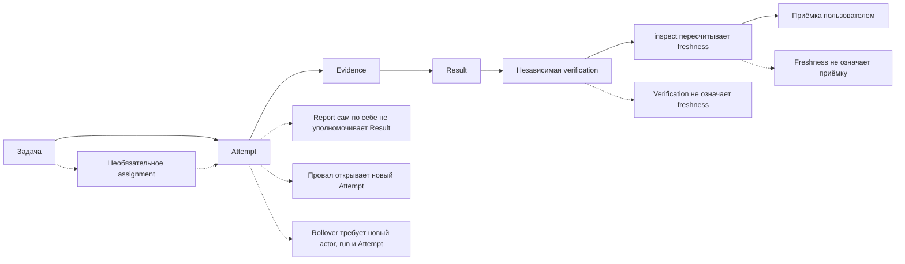
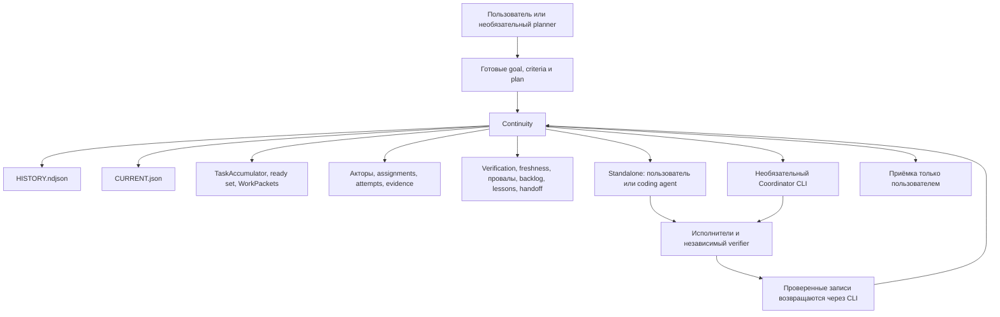

# Continuity

**Language / Язык:** [English](README.md) | **Русский**

**Локальная, source-backed непрерывность проекта, которая переживает смену чатов, моделей и исполнителей.**

Continuity — локальный Node.js продукт из трёх строго разделённых слоёв:

1. **Project Memory Core** — append-only журнал целей, попыток, evidence, verification и приёмки пользователя.
2. **Continuity** — плоскость чтения: inspect, ready set, freshness, handoff.
3. **Coordinator** — необязательный runtime исполнения. Он запускает адаптеры и пишет только через CLI Core.

Журнал авторитетен для того, что Continuity действительно записал. Живые файлы, Git и пользователь остаются авторитетны для самого проекта. Исторический PASS не является текущей истиной.

## Какой профиль скачивать

| Профиль | Когда | Содержит | Нужен Coordinator? |
| --- | --- | --- | --- |
| **Continuity Full** | Нужны память и исполнение в одном дереве | Core + Continuity + Coordinator | Нет; Memory работает отдельно |
| **Continuity Memory** | Нужны только журнал и inspect/handoff | Core + Continuity + protocol | Нет |
| **Continuity Coordinator** | Уже есть Memory CLI и нужно исполнение | Coordinator + protocol client + adapters | Подключается к Memory CLI |

Сборка zip:

```bash
node scripts/package-release.mjs dist
```

Скачайте подходящий zip. Проверьте `dist/SHA256SUMS` по файлам zip. Установка:

```bash
node scripts/install.mjs --profile full --dest /absolute/path/to/dest --dry-run
node scripts/install.mjs --profile memory --dest /absolute/path/to/dest
node scripts/install.mjs --profile coordinator --dest /absolute/path/to/dest
```

Затем doctor:

```bash
node continuity/scripts/continuity.mjs --version
node continuity/scripts/coordinator.mjs --version
node continuity/scripts/continuity.mjs doctor
node continuity/scripts/coordinator.mjs doctor --root .
```

`--version` печатает `continuity 2.0.0` и `continuity-coordinator 1.0.0`. `doctor` только читает и не создаёт store.

Первый сценарий после `journal=uninitialized`: отредактируйте `continuity/assets/init-v3.template.json`, чтобы goal и criterion были намерениями пользователя, затем `init --schema 3 --file ...`, `record task --class function`, приложите command/test evidence. Принять результат может только пользователь (`record accept --as user`). Подробности — в «Первые пять минут».

Memory-режим автономен: init, record, inspect, handoff, rebuild и приёмка только пользователем. Coordinator-режиму нужен runtime-адаптер. Поставляемый live-адаптер — `local-process` (текущий Node.js). Coordinator не может принять работу за пользователя.

Этот продукт не заявляет hosted-model execution, нативный discovery каждым coding agent, daemon или login task и то, что исторический PASS является текущим.

## Что это такое

Continuity — это не память модели. Это локальная, опирающаяся на исходники запись о работе над проектом: цели, ограничения, задачи, попытки, провалы, lessons, доказательства, независимая проверка, freshness и приёмка пользователем.

Вы запускаете `continuity/scripts/continuity.mjs` из Git-репозитория, который нужно помнить. Helper хранит данные в этом репозитории как `.continuity/HISTORY.ndjson` и `.continuity/CURRENT.json`. Каталог Skill — это код. Store — это данные проекта. И то и другое переживает конец чата.

Запись хранит не только успехи, но и неудачи. Старая заметка не становится текущей истиной. `inspect` заново вычисляет freshness по живому Git. Принять или отклонить результат может только пользователь.

Для работы нужны Node.js 22 или 24 (`package.json` engines: `>=22 <25`) и Git. Memory CLI не запускает модели, агентов, planner или Coordinator. Отдельный Coordinator CLI — явный foreground-процесс; он не поднимает daemon, сетевой сервис, interview или login task. Continuity может вызывать локальные команды Git, чтобы прочитать состояние репозитория.

Устанавливаемое дерево продукта — каталог `continuity/` плюс профильные документы этого репозитория.

GitHub по умолчанию показывает [английский README](README.md). Этот файл — русская версия.

## Какую проблему решает

Длительная агентная работа теряет факты, которые нужны следующим чатам. Continuity записывает эти факты, не превращая их в живую власть над проектом.

| Что обычно ломается | Что записывает Continuity | Чего он не делает |
| --- | --- | --- |
| Новый чат не знает, что уже произошло | `inspect` и `handoff` восстанавливают цели, задачи, попытки, провалы и следующие шаги | Восстановить незаписанную работу |
| Агент повторяет провалившийся подход | Провалы, lessons и next actions остаются в append-only журнале | Запретить повтор; он отказывается скрывать провал |
| Исторический PASS принимают за текущий | Freshness пересчитывается из живого Git и evidence в момент inspect | Заморозить PASS после позднейших правок |
| Отчёт исполнителя принимают за доказательство | `attempt.reported` не является authorizing evidence | Превратить слова в результат теста |
| Агенты правят пересекающиеся файлы | Assignments и path ownership исключают коллизии из ready set | Блокировать файловую систему |
| Теряются причины решений | Решения, ограничения и lessons — отдельные записи | Выдумать отсутствующее обоснование |
| Контекст заполняется, незавершённые попытки исчезают | Context handoff хранит последний шаг, фактическое состояние, провалившиеся гипотезы и точный следующий шаг | Продолжить предыдущий Attempt |
| Verification смешивают с приёмкой пользователя | Независимая проверка и `record accept --as user` — разные записи | Позволить Coordinator или verifier принять работу за пользователя |
| Backlog скрывает обязательную работу | Обязательные criteria нельзя припарковать, чтобы их обойти | Запретить парковку необязательной работы |
| Преемник видит только успешное резюме | Handoff включает провалы, ограничения, evidence и следующий шаг | Передать identity актора или закрыть старый Attempt |

Coordinator — необязательный foreground-runtime, поставляемый как `continuity/scripts/coordinator.mjs`. Memory/Continuity его не запускает. Его нужно запускать явно. `--help` печатает `usage: coordinator.mjs <doctor|plan|run|resume|status|cancel>`. Отдельного `--help` по командам нет.

## Пять осей истины

Эти состояния независимы. Ни одно не следует из другого.

**Execution → Evidence → Verification → Freshness → User acceptance**

| Ось | Смысл | Это не то же самое, что |
| --- | --- | --- |
| Execution | Result записывает, как работа исполнилась (`succeeded`, `failed`, `partial` и остальные execution-состояния) | Доказательство, freshness или приёмка |
| Evidence | Authorizing evidence — это связанное наблюдение `command` или `test` с exit code `0` | Отчёт исполнителя |
| Verification | `record verify` от другого актора и другого run, с явными счётчиками `found` / `executed` / `passed` / `failed` | Freshness или приёмка |
| Freshness | `inspect` заново оценивает возраст evidence по живому Git (HEAD и dirty worktree) | Сохранённый итог verification |
| User acceptance | Только `record accept --as user` или `record reject --as user --next "…"` | Любой технический PASS |

Attempt — это одна записанная попытка выполнить задачу. Result — записанный итог исполнения этой попытки. `record report` сохраняет рассказ актора об Attempt; это не evidence и не Result.

Правила, которые helper действительно проверяет:

- `attempt.reported` не является authorizing evidence.
- Слова исполнителя не являются доказательством. Отчёт без `--exit-code` сохраняется как `agent_report` и не может уполномочить успех.
- Authorizing evidence — связанное наблюдение `command` или `test` с exit code `0`.
- Независимый verifier должен отличаться от исполнителя и владельца Attempt. Run verifier должен отличаться от run исполнителя, если run id существуют.
- `record verify` также требует сохранённую запись `agent.registered` для этого verifier. Разные `--actor-id` и `--run-id` необходимы, но недостаточны.
- Идентичности по умолчанию `actor-<kind>` и `run-cli` не независимы и не могут проверить сами себя.
- Успешная verification не устанавливает freshness.
- Свежая verification не означает приёмку.
- Принять или отклонить результат может только пользователь. Coordinator, исполнитель и verifier не могут.
- Исторический PASS не является текущим PASS.

## Как это работает

Continuity держит три слоя, и они не равны.

1. **Живая реальность проекта.** Текущие файлы, Git, команды, тесты и решения пользователя. Это остаётся авторитетным для самого проекта.
2. **Авторитетный журнал Continuity.** `.continuity/HISTORY.ndjson` — ограниченная, append-only, hash-chained запись того, что Continuity действительно записал. Журнал авторитетен для записанной истории, а не для того, совпадает ли репозиторий с этой историей сейчас.
3. **Восстанавливаемая проекция.** `.continuity/CURRENT.json` — кэш, который пересобирается из журнала. Если он отсутствует, устарел или невалиден, `inspect` остаётся read-only. `rebuild` — явный ремонт проекции, а не запрос и не источник новой истины.

Старое доказательство может стать stale, когда Git сдвигается. Старый PASS не становится текущим PASS автоматически. Проекцию можно пересобрать из журнала; журнал нельзя пересобрать из проекции.

Предпочтительные записи идут через schema v3 recipes командой `record`. Schema v1 ещё существует для старых snapshot-store; команда `checkpoint` — это не путь v3. Schema v2 event store есть в helper, но в этой сборке v2 inspect не рисуется (`v2 inspect rendering is not available in this build`).

Полезные производные объекты, которые восстанавливаются из журнала:

- **TaskAccumulator** — задачи с priority, size, зависимостями, ownership, попытками, evidence, freshness и рекомендуемым следующим действием.
- **Ready set** — задачи, которые можно начинать сейчас. Он вычисляется в момент inspect и не является записью.
- **WorkPacket** — от одной до четырёх готовых задач с ownership, capabilities, проверками и completion contract.
- **Build-First** — пока у core-задачи класса `function` или `connector` нет Result с authorizing command/test evidence, неклассифицированная, документационная, тестовая и косметическая работа не попадает в ready set.

`--as` выбирает вид актора (`user`, `coordinator`, `subagent`, `tool`, `migration`). Это метка писателя. Она не запускает процесс. Если `--as` опустить, по умолчанию используется вид `coordinator`. Это метка, а не работающий Coordinator.

Журнал закрывается при 8 MiB. Вход ограничен. Неизвестные поля и ряд узнаваемых шаблонов секретов и частных данных отвергаются. Отклонённые записи оставляют журнал без изменений.



Провал дописывает lesson, next action и событие failure. Он не переписывает прежние события. Context rollover завершает сессию текущего актора; преемник начинает новый actor id, run id и Attempt.

## Граница системы

Прямое использование и координированное использование — альтернативные режимы, а не обязательная цепочка. Continuity не запускает исполнителей.



Continuity не является process manager. Необязательный Coordinator может читать `inspect ready` и `inspect wave`, выбирать зарегистрированных акторов и доступные модели, распределять проверенные WorkPackets, запускать исполнителей в агентной среде и писать обратно только через этот helper. Graphify — необязательный навигационный адаптер, а не источник истины. В этой сборке команда `graphify` сообщает, что поддержка Graphify недоступна.

## Standalone и координированный режимы

### Standalone

Пользователь или coding agent говорит с Continuity напрямую:

1. Запустите `doctor`. После появления store — `inspect` и `inspect ready --json`.
2. Передайте готовые goal, criteria и plan. Continuity не проводит interview и не выдумывает их.
3. `record task` с `--class function` или `--class connector`.
4. `record start`, приложите authorizing command или test evidence и сделайте `record result`.
5. Сохраните verifier через `record --file` как `agent.registered`, запустите эту проверку сами, затем `record verify` с другим актором и другим run.
6. Попросите пользователя сделать `record accept` или `record reject`.
7. Перед следующим чатом прочитайте `handoff --task <task-id>`.

Для этого цикла не нужны Coordinator, planner или другой Skill. Записи packet и assignment в standalone необязательны. Они нужны, когда helper должен проверить ownership и eligibility актора до начала работы.

### Необязательный координированный режим

Если вы запускаете необязательный Coordinator CLI или в агентной среде уже есть Coordinator, он может:

- читать `inspect ready` и `inspect wave`;
- выбирать из зарегистрированных акторов и доступных моделей;
- сохранять записи `agent.registered`, WorkPackets и assignments через helper;
- запускать исполнителей и другого verifier в этой среде;
- писать события только через проверенный CLI;
- интегрировать результат или начать repair/replan.

Он по-прежнему не может:

- править `HISTORY.ndjson` вручную;
- принять работу за пользователя;
- позволить модели или актору независимо проверить собственную работу;
- считать Graphify, вывод planner или прозу исполнителя authorizing evidence.

`project-memory.coordinator.v1` — стабильный compatibility identifier этого протокола. Это не имя продукта и не runtime-зависимость.

Команды верхнего уровня `coordinate` на Memory CLI нет. Команды Coordinator живут в `coordinator.mjs`. `interview.offered` всегда `false`.

## Установка

Continuity распространяется из [Altarnik88/continuity](https://github.com/Altarnik88/continuity) по лицензии MIT. Он не публикуется в package registry. У Skill нет runtime-шага `npm install`.

Можно вызывать CLI из клона или скопировать каталог Skill в skills-каталог конкретного агента. Пути discovery различаются. Этот репозиторий не заявляет нативную интеграцию с Codex, Claude, Cursor или любым другим продуктом.

### Прямой CLI

Клонируйте репозиторий и вызывайте helper абсолютным путём из Git worktree, который Continuity должен осмотреть:

```bash
git clone https://github.com/Altarnik88/continuity.git
cd continuity
node continuity/scripts/continuity.mjs --version
```

`--version` работает без установки зависимостей. Он печатает `continuity 2.0.0`.

Из другого целевого репозитория:

```bash
node "/absolute/path/to/clone/continuity/scripts/continuity.mjs" doctor
```

`doctor` только читает. На неинициализированном репозитории он сообщает `journal=uninitialized` и `projection=missing` и не создаёт store.

`inspect` требует существующий `HISTORY.ndjson`. До `init` голый `inspect` завершается с `authoritative HISTORY.ndjson is missing`. `inspect --json` и `inspect ready --json` на неинициализированном store сейчас падают с `v2 inspect rendering is not available in this build`. Ни один из этих вызовов store не создаёт.

Необязательный `--root` должен называть точный верхний уровень целевого worktree. Store по умолчанию — `<target-repository>/.continuity`. `CONTINUITY_STORE_DIR` может выбрать другой каталог относительно репозитория. Старые расположения `.codex/project-memory` автоматически не читаются и не импортируются.

`continuity/scripts/project-memory.mjs` — compatibility alias того же CLI.

### Установка как Skill агента

Скопируйте только `continuity/` и сохраните имя каталога назначения `continuity`. Путь skills-каталога и способ reload смотрите в документации своего агента.

PowerShell:

```powershell
$source = Resolve-Path '.\continuity'
$skillsRoot = Resolve-Path 'C:\path\documented-by-your-agent\skills'
$destination = Join-Path $skillsRoot 'continuity'
if (Test-Path -LiteralPath $destination) { throw "Destination already exists: $destination" }
Copy-Item -LiteralPath $source -Destination $destination -Recurse
node (Join-Path $destination 'scripts\continuity.mjs') --version
```

POSIX shell:

```bash
skills_root=/path/documented-by-your-agent/skills
test ! -e "$skills_root/continuity"
cp -R continuity "$skills_root/continuity"
node "$skills_root/continuity/scripts/continuity.mjs" --version
```

Успешное копирование доказывает, что файлы и CLI на месте. Оно не доказывает, что агент обнаружил Skill.

`examples/AGENTS.snippet.md` — заготовка инструкций, которую можно адаптировать.

Обновление: замените только установленный каталог `continuity/`. Удаление: уберите только этот каталог. Не удаляйте `<repository>/.continuity`, если вы отдельно не собираетесь стереть данные непрерывности проекта.

## Первые пять минут

Запускайте это из Git-репозитория, который Continuity должен помнить. Замените `/absolute/path/to/continuity` на клонированный или установленный каталог Skill.

```bash
node "/absolute/path/to/continuity/scripts/continuity.mjs" --version
node "/absolute/path/to/continuity/scripts/continuity.mjs" doctor
```

Если `doctor` сообщает `journal=uninitialized`, просмотрите `continuity/assets/init-v3.template.json`, замените примерные goal и criterion на реальное намерение пользователя, затем:

```bash
node "/absolute/path/to/continuity/scripts/continuity.mjs" init --schema 3 --file "/absolute/path/to/continuity/assets/init-v3.template.json"
node "/absolute/path/to/continuity/scripts/continuity.mjs" doctor
node "/absolute/path/to/continuity/scripts/continuity.mjs" inspect
```

`init` отказывается поверх уже инициализированного store. Шаблон создаёт user-backed goal и один обязательный criterion. Он не создаёт задачи. После этого шаблона `inspect ready --json` сообщает `plan.missing: ["taskAccumulator"]`, пока вы не запишете задачу. Если `plan.missing` непустой, не назначайте работу. Continuity не выдумает недостающие требования.

Запишите одну core-задачу класса `function`:

```bash
node "/absolute/path/to/continuity/scripts/continuity.mjs" record task --title "Name the work" --priority core --size S --class function --as coordinator --actor-id actor-writer --run-id run-plan-01
node "/absolute/path/to/continuity/scripts/continuity.mjs" inspect ready --json
```

`--as coordinator` здесь только вид писателя. Он не запускает Coordinator.

На v3 store inspect после шаблона выглядит так:

```text
GOAL goal-final Keep truthful project continuity
CRITERIA criterion-honest
CONFIRMED none
UNVERIFIED none
STALE none
FAILURES none
REJECTED none
BLOCKED none
CONFLICTS none
ACTORS user:actor-user
NEXT none
PROHIBITED none
```

`inspect ready` без `--json` печатает короткий coordination view. `inspect wave` всегда печатает JSON.

## Основной цикл

Этот цикл — для нетривиальной реализации. Read-only, тривиальная, no-op или неопределённая работа может inspect и не должна писать.

`--as` — вид актора. `--actor-id` и `--run-id` называют писателя. `record assign --assignee` называет актора, которому принадлежит assignment; он может отличаться от писателя. Стабильные id выглядят как `actor-writer` и `run-plan-01`.

Core-задача без `--class function` или `--class connector` сохраняется как `unclassified` и не готова до Build-First. Пропуск `--class` не валит запись; `inspect wave` исключает её как `unclassified-task-class`.

Standalone-исполнение может начаться сразу после `record task`:

```bash
node "/absolute/path/to/continuity/scripts/continuity.mjs" record start --task <task-id> --approach "One sentence" --as subagent --actor-id actor-exec-01 --run-id run-exec-01
node "/absolute/path/to/continuity/scripts/continuity.mjs" record report --execution partial --as subagent --actor-id actor-exec-01 --run-id run-exec-01
node "/absolute/path/to/continuity/scripts/continuity.mjs" record evidence --expected "check passes" --actual "exit 0" --kind command --exit-code 0 --as subagent --actor-id actor-exec-01 --run-id run-exec-01
node "/absolute/path/to/continuity/scripts/continuity.mjs" record result --expected "check passes" --actual "what happened" --as subagent --actor-id actor-exec-01 --run-id run-exec-01
```

`record report` не уполномочивает Result. Evidence без `--exit-code` — это `agent_report` и тоже не уполномочивает успех.

Чтобы назначить работу или записать независимую verification, сначала сохраните акторов. Рецепта `record register` нет. Используйте `record --file` с `agent.registered`:

```json
{
  "eventType": "agent.registered",
  "occurredAt": "2026-08-21T00:00:00.000Z",
  "actor": { "kind": "coordinator", "id": "actor-writer", "role": "coordinator", "runId": "run-plan-01" },
  "subject": { "type": "agent", "id": "actor-exec-01" },
  "supersedes": [],
  "contradicts": [],
  "evidenceRefs": [],
  "sensitivity": "internal",
  "payload": {
    "agent": {
      "actorId": "actor-exec-01",
      "providerFamily": "local",
      "modelFamily": "small",
      "capabilityProfiles": ["implementation"],
      "costTier": "lowest",
      "speedTier": "fast",
      "trustTier": "standard",
      "calibrationStatus": "calibrated",
      "kind": "subagent"
    }
  }
}
```

Зарегистрируйте исполнителя и другого verifier, затем:

```bash
node "/absolute/path/to/continuity/scripts/continuity.mjs" record --file executor.json
node "/absolute/path/to/continuity/scripts/continuity.mjs" record --file verifier.json
node "/absolute/path/to/continuity/scripts/continuity.mjs" inspect wave --json
node "/absolute/path/to/continuity/scripts/continuity.mjs" record packet --task <task-id> --as coordinator --actor-id actor-writer --run-id run-plan-01
node "/absolute/path/to/continuity/scripts/continuity.mjs" record assign --task <task-id> --assignee actor-exec-01 --as coordinator --actor-id actor-writer --run-id run-plan-01
node "/absolute/path/to/continuity/scripts/continuity.mjs" record verify --as subagent --actor-id actor-verify-01 --run-id run-verify-01 --result <result-id> --found 1 --executed 1 --passed 1 --failed 0
node "/absolute/path/to/continuity/scripts/continuity.mjs" record accept --as user --result <result-id>
```

`record assign` нужен соответствующий сохранённый packet и зарегистрированный assignee. `record verify` нужен зарегистрированный verifier, чей actor id и run id отличаются от исполнителя и владельца Attempt.

Если попытка провалилась:

```bash
node "/absolute/path/to/continuity/scripts/continuity.mjs" record fail --why "what broke" --impact "what is stuck" --next "different next step" --as subagent --actor-id actor-exec-01 --run-id run-exec-01
```

Это дописывает lesson, next action и failure. Повторите через новый `record start` и изменённый подход. Не переписывайте провалившийся Attempt.

Если контекст заполняется:

```bash
node "/absolute/path/to/continuity/scripts/continuity.mjs" record context --next "Exact next step" --as subagent --actor-id actor-exec-01 --run-id run-exec-01
node "/absolute/path/to/continuity/scripts/continuity.mjs" handoff --task <task-id>
```

`handoff` только читает и требует задачу. Преемник использует новый `--actor-id`, `--run-id` и Attempt. После частичного handoff `record start` нужен явный `--task`. Переставайте назначать новые packets около 65% использованного контекста, если среда сообщает достоверную долю; остаток оставьте на focused check или handoff.

Отклонение пользователем тоже требует следующего шага:

```bash
node "/absolute/path/to/continuity/scripts/continuity.mjs" record reject --as user --result <result-id> --next "Different next step"
```

После любой записи запустите `validate` и `inspect`. Не редактируйте файлы журнала и проекции вручную. Для lock и восстановления следуйте [security-workflow.md](continuity/references/security-workflow.md). Записи в store из linked worktree отклоняются; мутации делайте из primary worktree.

Команды верхнего уровня:

```text
usage: continuity.mjs <init|record|inspect|history|handoff|validate|doctor|rebuild|migrate|graphify>
```

`--help` печатает этот usage и путь store по умолчанию. Отдельных `inspect --help` и `record --help` нет. v3 recipes для `record`: `task`, `start`, `evidence`, `result`, `fail`, `accept`, `reject`, `assign`, `packet`, `release`, `report`, `verify`, `context` и `backlog`. Сырые черновики по-прежнему идут через `record --file` или `record --stdin`.

`migrate` и `graphify` есть в usage. В этой сборке они сообщают, что migration и Graphify недоступны, и выходят без записи.

## Реальные сценарии

| Ситуация | Что обычно ломается | Как помогает Continuity | Чего он не автоматизирует |
| --- | --- | --- | --- |
| Долгая фича через много чатов | Следующий чат заново открывает задачу | `inspect` и `handoff` восстанавливают goal, попытки, evidence и следующий шаг | Возобновить сессию предыдущего актора |
| Brownfield-репозиторий с существующим WIP | Агенты считают грязные файлы чистым листом | `doctor` и inspect сравнивают записанный workspace с живым Git | Выдумать план для незаписанного WIP |
| Параллельная реализация несколькими агентами | Два агента берут одни и те же файлы | Ready set и assignments исключают пересекающийся ownership | Запустить агентов |
| Большой рефакторинг с пересекающимся ownership | Коллизии путей видны уже после порчи | Ownership проверяется снова на `record assign` | Слить конфликтующие правки |
| Security-sensitive ремонт | Отчёт принимают за security PASS | Правила изоляции, независимая verification и приёмка только пользователем остаются разными | Сканировать уязвимости |
| Миграция базы или схемы | Провалившийся rollback повторяют молча | Провалы и запрещённые подходы остаются в журнале | Выполнить миграцию |
| Провалившийся подход, который нельзя повторять | Следующий исполнитель видит только последнее резюме | `record fail` хранит симптом, impact, lesson и следующий шаг | Помешать оператору проигнорировать эту запись |
| Контекстное окно подходит к пределу | Частичная работа исчезает вместе с чатом | `record context` и read-only `handoff` хранят точный следующий шаг | Сам измерить токены |
| Замена исполнителя или модели | Преемник наследует открытый Attempt | Замена требует новый actor, run и Attempt | Выбрать модель-замену |
| Независимая проверка перед релизом | Реализатор «проверяет» свою работу | Тот же актор или тот же run — no-effect rejection | Запустить тесты |
| Приёмка пользователем после технической проверки | Coordinator помечает работу сделанной | Только `--as user` меняет acceptance | Принять работу от имени пользователя |
| Возврат к заброшенному проекту через недели | Исторический PASS доверяют сдвинутому HEAD | Inspect пересчитывает freshness; stale evidence виден | Сделать rebase, перезапуск или restore backup |

Реалистичный провал, а не переписанный happy path: агент миграции записывает провалившуюся гипотезу rollback и затронутые пути. Преемник читает эту историю в handoff, открывает новый Attempt и пробует другой подход вместо того, чтобы молча повторить тот же rollback.

## Где Continuity действительно нужен

Continuity полезен, когда цена забвения выше цены нескольких ограниченных фактов: долгая работа над репозиторием, больше одного coding agent на одном repo, dirty Git, миграции и security-ремонты, где нельзя потерять историю провалов, и любая задача, в которой нужно отличить «тест только что прошёл» от «пользователь это принял».

Журнал сохраняет, что просили, что пробовали, какие подходы провалились, что доказано, насколько это доказательство свежо, что всё ещё заблокировано, чего пользователь ещё не принял, и что должен сделать следующий актор. Это не архив чата.

## Когда Continuity не нужен

Не используйте Continuity как:

- журнал одноразовой тривиальной правки;
- хранилище секретов и credentials;
- свалку сырых логов, diff или вывода команд;
- замену Git;
- issue tracker;
- систему backup;
- tamper-proof audit database;
- автоматический process manager;
- маршрутизатор моделей;
- daemon или сетевой orchestration-сервис;
- универсальную нативную интеграцию с каждым coding agent;
- автоматическое доказательство корректности.

Если работа — одна очевидная правка, сделайте правку. Если это длинная агентная сессия, которую продолжит тот, кого в комнате не было, запишите Continuity.

## Структура репозитория

Это worktree содержит 132 файла. Устанавливаемый Skill — `continuity/` (61 файл). Корневые `tests/` и `scripts/` — разработка и release tooling. GitHub по умолчанию показывает [`README.md`](README.md); этот файл — русская версия.

```text
.
├── continuity/                 # устанавливаемый Skill (копируйте этот каталог)
│   ├── SKILL.md                # инструкции Skill и frontmatter
│   ├── assets/                 # init, snapshot и coordinator.config.json
│   ├── references/             # канонические протокольные документы и JSON Schema
│   └── scripts/
│       ├── continuity.mjs      # Memory/Continuity CLI
│       ├── coordinator.mjs     # необязательный Coordinator CLI
│       ├── project-memory.mjs  # compatibility alias для continuity.mjs
│       ├── smokes/             # smokes профилей установки
│       └── lib/
│           ├── core/           # журнал, recipes, inspect, store
│           │   └── coordination/
│           ├── continuity/     # адаптер v2 inspect (в этой сборке stub)
│           ├── coordinator/    # foreground runtime, адаптеры, run-state
│           ├── protocol/       # общие ports и client
│           ├── graphify/       # необязательный адаптер Graphify (stub)
│           └── migration/      # явная миграция (stub)
├── tests/                      # тесты репозитория; после установки не нужны
├── scripts/                    # validate, install, package-release
├── examples/                   # snapshots, AGENTS snippet, coordinator.config.json
├── .github/workflows/          # CI
├── ADAPTERS.md
├── ARCHITECTURE.md
├── CHANGELOG.md
├── COORDINATOR.md
├── INSTALL.md
├── MIGRATION.md
├── PROTOCOL.md
├── README.md
├── README.ru.md
├── RELEASE.md
├── SECURITY.md
├── LICENSE
├── package.json
└── package-lock.json
```

| Путь | Что это | Нужен после установки? | Тип |
| --- | --- | --- | --- |
| `continuity/` | Полный распространяемый Skill | Да | runtime |
| `continuity/SKILL.md` | Инструкции установленного Skill (`name: continuity`) | Да | runtime docs |
| `continuity/assets/` | шаблоны init/snapshot и `coordinator.config.json` | Да, для `init` и Coordinator | runtime templates |
| `continuity/references/` | Протокольные руководства и переносимые JSON Schema | Да, как справка | runtime docs |
| `continuity/scripts/continuity.mjs` | Канонический Memory/Continuity CLI | Да | runtime |
| `continuity/scripts/coordinator.mjs` | Необязательный Coordinator CLI | Да, для Coordinator/Full | runtime |
| `continuity/scripts/project-memory.mjs` | Compatibility alias, который импортирует `continuity.mjs` | Только для старых путей вызова | runtime alias |
| `continuity/scripts/lib/core/` | Domain, журнал, recipes, inspect, workspace, store | Да | runtime |
| `continuity/scripts/lib/core/coordination/` | TaskAccumulator, ready set, packets, registry, persist policy | Да | runtime |
| `continuity/scripts/lib/coordinator/` | Coordinator engine, config, адаптеры, run-state | Да, для Coordinator/Full | runtime |
| `continuity/scripts/lib/protocol/` | Общие protocol ports и CLI client | Да | runtime |
| `continuity/scripts/lib/continuity/` | Точка входа v2 inspect | Есть; в этой сборке сообщает, что недоступна | runtime stub |
| `continuity/scripts/lib/graphify/` | Команда Graphify | Есть; в этой сборке сообщает, что недоступна | runtime stub |
| `continuity/scripts/lib/migration/` | Команда migrate | Есть; в этой сборке сообщает, что недоступна | runtime stub |
| `tests/` | Тесты core, protocol, coordinator, package и helpers | Нет | tests |
| `scripts/` | validate, install, package-release, forward acceptance | Нет | release tooling |
| `.github/workflows/` | Матрица CI | Нет | release tooling |
| `examples/` | Snapshot-фикстуры, `AGENTS.snippet.md`, `coordinator.config.json` | По желанию | examples |
| Документы продукта, `LICENSE`, `package.json` | ARCHITECTURE, PROTOCOL, INSTALL, COORDINATOR, ADAPTERS, MIGRATION, RELEASE, CHANGELOG, README, SECURITY | LICENSE едет вместе с копией Skill | docs / metadata |

`npm pack --dry-run` содержит 79 файлов: Skill, examples, лицензию, документы продукта, оба README и `package.json`. Этот tarball не является единицей установки. Установка копирует `continuity/` или zip профиля.

<details>
<summary>Файлы worktree (132)</summary>

```text
.gitattributes
.github/workflows/ci.yml
.gitignore
ADAPTERS.md
ARCHITECTURE.md
CHANGELOG.md
COORDINATOR.md
INSTALL.md
LICENSE
MIGRATION.md
PROTOCOL.md
README.md
README.ru.md
RELEASE.md
SECURITY.md
continuity/SKILL.md
continuity/assets/coordinator.config.json
continuity/assets/init-v2.template.json
continuity/assets/init-v3.template.json
continuity/assets/snapshot-v1.template.json
continuity/references/context-rollover.md
continuity/references/coordination.md
continuity/references/inspect-v1.schema.json
continuity/references/installation.md
continuity/references/project-execution.md
continuity/references/projection-v2.schema.json
continuity/references/scheduling.md
continuity/references/schema.md
continuity/references/security-workflow.md
continuity/references/snapshot-v1.schema.json
continuity/references/task-accumulator.md
continuity/references/v2-contract.schema.json
continuity/references/verification-swarm.md
continuity/scripts/continuity.mjs
continuity/scripts/coordinator.mjs
continuity/scripts/lib/continuity/index.mjs
continuity/scripts/lib/coordinator/adapters/fake.mjs
continuity/scripts/lib/coordinator/adapters/index.mjs
continuity/scripts/lib/coordinator/adapters/local-process.mjs
continuity/scripts/lib/coordinator/adapters/local-worker.mjs
continuity/scripts/lib/coordinator/cli.mjs
continuity/scripts/lib/coordinator/config.mjs
continuity/scripts/lib/coordinator/engine.mjs
continuity/scripts/lib/coordinator/index.mjs
continuity/scripts/lib/coordinator/run-state.mjs
continuity/scripts/lib/core/cli-v3.mjs
continuity/scripts/lib/core/cli.mjs
continuity/scripts/lib/core/coordination/accumulator.mjs
continuity/scripts/lib/core/coordination/contract.mjs
continuity/scripts/lib/core/coordination/index.mjs
continuity/scripts/lib/core/coordination/persist-policy.mjs
continuity/scripts/lib/core/coordination/registry.mjs
continuity/scripts/lib/core/coordination/schedule.mjs
continuity/scripts/lib/core/domain-v2.mjs
continuity/scripts/lib/core/domain-v3.mjs
continuity/scripts/lib/core/input-v3.mjs
continuity/scripts/lib/core/inspect-v3.mjs
continuity/scripts/lib/core/journal-v2.mjs
continuity/scripts/lib/core/journal-v3.mjs
continuity/scripts/lib/core/legacy-v1.mjs
continuity/scripts/lib/core/recipes-v3.mjs
continuity/scripts/lib/core/store.mjs
continuity/scripts/lib/core/workspace-v3.mjs
continuity/scripts/lib/graphify/index.mjs
continuity/scripts/lib/migration/index.mjs
continuity/scripts/lib/protocol/adapter.mjs
continuity/scripts/lib/protocol/client.mjs
continuity/scripts/lib/protocol/compatibility.mjs
continuity/scripts/lib/protocol/index.mjs
continuity/scripts/lib/protocol/ports.mjs
continuity/scripts/lib/protocol/secrets.mjs
continuity/scripts/lib/protocol/validate.mjs
continuity/scripts/project-memory.mjs
continuity/scripts/smokes/coordinator.mjs
continuity/scripts/smokes/full.mjs
continuity/scripts/smokes/memory.mjs
examples/AGENTS.snippet.md
examples/coordinator.config.json
examples/snapshot.minimal.json
examples/snapshot.source-backed.json
examples/source-anchor.md
package-lock.json
package.json
scripts/install.mjs
scripts/package-inventory.mjs
scripts/package-release.mjs
scripts/release-profiles.mjs
scripts/test-continuity.mjs
scripts/test-coordinator.mjs
scripts/test-forward-acceptance.mjs
scripts/test-package-install.mjs
scripts/test-package.mjs
scripts/test-protocol.mjs
scripts/test-release.mjs
scripts/test-validate-package.mjs
scripts/validate-package.mjs
scripts/zip-store.mjs
tests/coordinator/runtime.test.mjs
tests/coordinator/security.test.mjs
tests/core/actor-identity-cli.test.mjs
tests/core/adverse-retry.test.mjs
tests/core/all-event-paths.test.mjs
tests/core/append-freshness-authority.test.mjs
tests/core/atomic-recipes.test.mjs
tests/core/bindings.test.mjs
tests/core/cli-contract.test.mjs
tests/core/continuity-runtime.test.mjs
tests/core/contracts.test.mjs
tests/core/coordination.test.mjs
tests/core/criterion-revision-owner.test.mjs
tests/core/duplicate-event.test.mjs
tests/core/failure-schema-parity.test.mjs
tests/core/final-goal-authority.test.mjs
tests/core/integration-seams.test.mjs
tests/core/journal-cli.test.mjs
tests/core/migration-invariants.test.mjs
tests/core/projection-order.test.mjs
tests/core/required-goal-task.test.mjs
tests/core/schemas.test.mjs
tests/core/security.test.mjs
tests/core/stdin-bound.test.mjs
tests/core/suite-aggregator.test.mjs
tests/core/task-revised.test.mjs
tests/core/transitions.test.mjs
tests/core/truth-closure.test.mjs
tests/core/v3-crash-concurrent.test.mjs
tests/core/v3-e2e.test.mjs
tests/core/workspace-fingerprint.test.mjs
tests/helpers/repository.mjs
tests/helpers/suite-aggregator.mjs
tests/helpers/v2-contract-fixture.mjs
tests/protocol/protocol.test.mjs
```

</details>

## Модель безопасности

Continuity локален и fail-closed. Это не security-продукт.

Что он делает:

- работает локально с Node.js и Git; для обычного использования не открывает сетевой клиент;
- держит store внутри целевого репозитория, обычными файлами ограниченного размера;
- hash-chain `HISTORY.ndjson`, чтобы читатели могли заметить сломанную цепочку;
- отвергает path traversal, reparse/alias escapes и ряд узнаваемых шаблонов секретов и частных данных;
- отказывается от тихого редактирования журнала: записи идут через helper;
- отказывается автоматически импортировать legacy store `.codex/project-memory`;
- отказывается автоматически сливать расходящиеся журналы;
- считает Graphify receipts неуполномочивающими, если они есть;
- не запускает daemon, interview или автоматический установщик моделей.

Чего он не делает:

- это не сканер секретов, классификатор приватности, DLP или система контроля доступа;
- успешные `validate`, dry-run или lint не доказывают, что содержимое безопасно;
- актор, который может переписать и репозиторий, и checker, может пересобрать hash chain;
- `CURRENT.json` не является backup.

Не записывайте credentials, токены, cookies, строки подключения, присваивания `.env`, персональные данные, клиентские payload, сырые строки БД, сырые diff, логи, stack dump, вывод команд или абсолютные локальные пути. Уязвимости сообщайте приватно через [Continuity security advisories](https://github.com/Altarnik88/continuity/security/advisories/new). Не прикладывайте настоящий Continuity store к публичному issue.

## Совместимость и legacy-идентификаторы

Имя продукта — Continuity.

`project-memory.coordinator.v1` остаётся идентификатором протокола Coordinator, чтобы существующие потребители не переименовывали контракт. Это не Skill, не зависимость и не название продукта.

`continuity/scripts/project-memory.mjs` — compatibility alias, который загружает `continuity.mjs`. Новые документы и вызовы должны использовать `continuity.mjs`.

Store по умолчанию — `.continuity`. Legacy-каталог `.codex/project-memory` можно обнаружить как metadata для миграции под контролем оператора. Эта сборка не читает те записи автоматически, а `migrate` сообщает, что поддержка миграции недоступна.

## Текущие ограничения

- Предпочтительные новые store — schema v3. Snapshot store schema v1 и event store schema v2 в helper ещё существуют.
- v2 inspect rendering в этой сборке недоступен.
- `migrate` и `graphify` есть на поверхности CLI и недоступны в этой сборке.
- На v3 store `history` сейчас рисует inspect view, а не хвост событий. `--tail` относится к v1/v2 history.
- `handoff` требует задачу. Это не замена `record context`.
- `inspect` не инициализирует store. На пустом репозитории используйте `doctor`.
- Отдельного `--help` для `inspect`, `record` или команд Coordinator нет.
- Рецепта `record register` нет. Акторы для assignment или verification должны быть сохранены через `record --file` как `agent.registered`.
- Continuity `--version` печатает `2.0.0`; Coordinator `--version` печатает `continuity-coordinator 1.0.0`; версия `package.json` — `1.0.0`.
- Node engines — `>=22 <25`. Формулировка «Node.js 22+» в тексте Skill всё равно означает поддерживаемый runtime Node 22 или 24.
- Журнал ограничен (8 MiB) и линеен. Нет автоматического rollover, архива, upgrade или слияния журналов.
- Multi-event recipes делают preflight, затем дописывают последовательно. Это не одна транзакционная запись.
- Планирование ready set детерминировано, но Continuity не запускает назначенных акторов.
- Pattern guards — best-effort. Они пропустят закодированные секреты и нетипичные PII.
- Этот репозиторий не заявляет нативный discovery каждым coding agent.

## Разработка и проверка

Локальный `npm run validate` на этом трёхслойном worktree:

```text
package validation: ok (worktree 132 files; skill 61; repo-only 0; metadata 71; npm-pack 79 files, not the standalone Skill artifact)
```

`npm run check` это:

```bash
npm run validate && npm test && npm run test:package && npm run test:forward && npm run test:release
```

GitHub Actions CI использует `ubuntu-latest`, `windows-latest` и `macos-latest` с Node 22 и 24, ровно один pinned checkout, `timeout-minutes: 15`, `npm ci --ignore-scripts`, именованные lane protocol/coordinator, Combined check (`npm run check`), smokes профилей и `npm run audit:dev`. Combined check выполняет локальный агрегат, а не только упоминает его.

Локальные пробы helper:

- `node continuity/scripts/continuity.mjs --version` → `continuity 2.0.0`
- `node continuity/scripts/coordinator.mjs --version` → `continuity-coordinator 1.0.0`
- `doctor` на пустом Git worktree → `journal=uninitialized`
- `coordinator.mjs doctor --root .` → `daemon=false`, `adapter=local-process`, `adapter-class=live`
- `init --schema 3 --file continuity/assets/init-v3.template.json` → `continuity v3 initialized`
- `inspect`, `inspect ready --json`, `inspect wave --json` и `record task --class function` ведут себя как описано выше
- `graphify observe` → Graphify support is not available (exit 4)
- `migrate --to 2` → migration support is not available (exit 3)

Команды для контрибьютора:

```bash
npm ci --ignore-scripts
npm run check
npm run audit:dev
```

## FAQ

**Почему в репозитории всё ещё есть `project-memory`?**

Потому что `project-memory.coordinator.v1` — стабильный id протокола, а `scripts/project-memory.mjs` — compatibility alias. Продукт называется Continuity. Эти строки — не второй Skill и не обязательный Coordinator.

**Нужен ли Continuity Coordinator?**

Нет. Standalone Memory/Continuity — полноценный продукт. Coordinator — необязательный поставляемый CLI (`continuity/scripts/coordinator.mjs`). Memory его не запускает.

**Нужен ли Continuity planner?**

Нет. Передайте готовые goal, criteria и plan сами или пусть любой planning-инструмент подготовит этот вход. Недостающий вход остаётся `plan.missing`.

**Почему в standalone-примерах есть `--as coordinator`?**

`--as` — вид актора, а не запуск процесса. Helper по умолчанию использует вид `coordinator`, если `--as` опущен. Это не запускает Coordinator.

**Почему `record assign` или `record verify` падают с unregistered actor?**

Assignment и независимая verification требуют сохранённую запись `agent.registered` для этого актора. Одних разных `--actor-id` недостаточно.

**Можно ли указать агенту на этот GitHub-репозиторий и ждать нативный discovery?**

Не по этому README. Скопируйте `continuity/` в skills-каталог, который документирует ваш агент, или вызывайте CLI по пути.

**Журнал tamper-proof?**

Нет. Hash-chaining ловит случайную или неаккуратную порчу. Он не останавливает того, кто может переписать файлы и checker.

**Можно ли слить два Continuity store?**

Нет. Не используйте union merge driver для `HISTORY.ndjson`. Linked worktree могут inspect; расходящихся писателей быть не должно.

**Что если нет `CURRENT.json`?**

Журнал остаётся авторитетным для записанных событий. `inspect` остаётся read-only. `rebuild` используйте только как намеренный ремонт проекции на v3 store.

**Почему `inspect` падает до `init`?**

Потому что журнала ещё нет. `doctor` — зонд неинициализированного store. `inspect` не создаёт `HISTORY.ndjson`.

**Почему версии CLI и пакета разные?**

Continuity `--version` печатает `continuity 2.0.0`. Coordinator `--version` печатает `continuity-coordinator 1.0.0`. Версия `package.json` — `1.0.0`. Это независимые строки.

## Лицензия

[MIT License](LICENSE). Copyright (c) 2026 Altarnik88.

## Как начать

1. Клонируйте [Altarnik88/continuity](https://github.com/Altarnik88/continuity).
2. Вызывайте `continuity/scripts/continuity.mjs` абсолютным путём или скопируйте `continuity/` в skills-каталог своего агента.
3. Из целевого Git-репозитория запустите `--version` и `doctor`.
4. Если store неинициализирован, отредактируйте v3-шаблон и выполните `init --schema 3 --file .../init-v3.template.json`.
5. Запишите задачу класса `function` или `connector`, приложите command/test evidence, проверьте зарегистрированным другим актором и run и дайте принять результат только пользователю.

Дальше читайте:

- [Install](INSTALL.md)
- [Architecture](ARCHITECTURE.md)
- [Coordinator](COORDINATOR.md)
- [Adapters](ADAPTERS.md)
- [Protocol](PROTOCOL.md)
- [Migration](MIGRATION.md)
- [Release](RELEASE.md)
- [Инструкции Skill](continuity/SKILL.md)
- [Установка](continuity/references/installation.md)
- [Исполнение проекта](continuity/references/project-execution.md)
- [Контракт Coordinator](continuity/references/coordination.md)
- [Накопление задач](continuity/references/task-accumulator.md)
- [Планирование](continuity/references/scheduling.md)
- [Context rollover](continuity/references/context-rollover.md)
- [Независимая проверка](continuity/references/verification-swarm.md)
- [Snapshot schema](continuity/references/schema.md)
- [Security workflow](continuity/references/security-workflow.md)
- [SECURITY.md](SECURITY.md)
