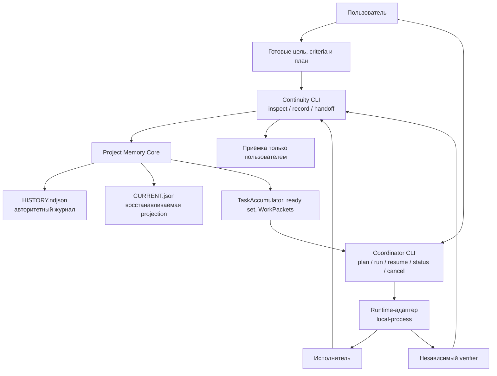

<a id="lang-ru"></a>

# Continuity

<p align="center"><a href="https://github.com/Altarnik88/continuity#lang-en">English</a> · <strong>Русский</strong></p>

**Локальная плоскость управления долгой агентной работой: память, которая переживает чаты, и явное управление исполнителями и проверками.**

Continuity — скачиваемый Node.js-продукт для Git-репозитория. Он делает две работы, которые сессии обычно смешивают и потом теряют:

1. **Помнить истину проекта** — цели, провалившиеся попытки, доказательства, независимую проверку, freshness и то, принял ли результат *пользователь*.
2. **Управлять агентами как роем, а не как одним чатом** — готовая работа, изоляция ownership, WorkPackets, запуск исполнителей, независимый verifier, restart и остановка. Слова исполнителя никогда не считаются доказательством.

Его скачивают, когда следующий чат, другая модель или новый исполнитель должны продолжить без угадывания — и когда на одном репозитории работают несколько акторов без столкновений и без приёмки работы «за пользователя».

Нужны Node.js 22 или 24 (`package.json` engines: `>=22 <25`) и Git. Лицензия MIT. Распространяется с [Altarnik88/continuity](https://github.com/Altarnik88/continuity), не из package registry.

## Зачем это скачивать и использовать

Долгая агентная работа ломается двумя независимыми способами.

**Сбой памяти.** Новый чат не знает цель, провалившиеся подходы, последние доказательства и точный следующий шаг. Исторический PASS верят против сдвинутого Git HEAD. Исполнитель «проверяет» сам себя. Кто-то кроме пользователя помечает работу принятой.

**Сбой управления.** Два агента правят одни файлы. Ready-работу угадывают, а не выводят. Coordinator подразумевают, но никогда не запускают. Отчёт исполнителя принимают за результат теста. Новый актор продолжает чужой Attempt. Обязательные criteria исчезают в backlog.

Continuity нужен, чтобы эти сбои оставались видимыми и ограниченными:

| Что нужно | Зачем скачивать Continuity |
| --- | --- |
| Работа через много чатов и моделей | `inspect` и `handoff` восстанавливают записанную истину и не выдумывают незаписанную историю |
| Провалившиеся подходы, которые нельзя молча повторять | Провалы, lessons и запрещённые подходы остаются в append-only журнале |
| Несколько агентов на одном репозитории | Ready set, path ownership и assignments исключают пересекающуюся работу |
| Доказательство против разговора | Authorizing evidence — это `command` или `test` с кодом выхода `0`; отчёт — не evidence |
| Независимая проверка | Нужен другой актор и другой run; self-verify — отказ без эффекта |
| Власть человека | Только `record accept --as user` или `record reject --as user` меняет приёмку |
| Настоящее исполнение, а не эссе про протокол | Необязательный Coordinator CLI запускает адаптеры на переднем плане и пишет обратно только через Memory CLI |

**Не** скачивайте его как замену Git, трекер задач, хранилище секретов, витрину hosted-моделей, daemon или автоматическое доказательство корректности. Если правка одна и очевидная — просто сделайте её. Если следующего актора не было в комнате — используйте Continuity.

## Что это такое

Continuity — это не память модели и не скрытый запуск агентов. Это три строго разделённых слоя в одном репозитории:

| Слой | Задача | Не его задача |
| --- | --- | --- |
| **Project Memory Core** | Владеть долговременной записанной истиной | Выбирать модель, запускать процесс, принимать работу за пользователя |
| **Continuity** | Плоскость чтения для следующего чата или актора | Стать Coordinator или запускать исполнителей |
| **Coordinator** | Плоскость исполнения: пакеты, адаптеры, волны, resume | Править журнал, считать отчёт доказательством, принимать за пользователя |

С Core и Continuity вы говорите через:

```text
usage: continuity.mjs <init|record|inspect|history|handoff|validate|doctor|rebuild|migrate>
```

С управлением агентами — через **отдельный** foreground CLI:

```text
usage: coordinator.mjs <doctor|plan|run|resume|status|cancel>
```

Memory никогда не запускает Coordinator. Coordinator никогда не стартует как daemon, watcher, login task или сетевой сервис. Оба CLI только явные.

Код Skill — каталог `continuity/`. Данные проекта — в целевом Git-репозитории: `.continuity/HISTORY.ndjson` (авторитетный журнал) и `.continuity/CURRENT.json` (восстанавливаемая projection). Состояние Coordinator, если вы его используете, — `.continuity/coordinator/runs`. И код, и данные переживают конец чата.

## Контур проекта

Это не обязательный конвейер. Прямая работа с Memory и координированное исполнение — альтернативные режимы.



Путь записи: каждое долговременное событие идёт через `continuity/scripts/continuity.mjs`. Coordinator может только запускать этот CLI (или эквивалентный валидированный Core API). Он не должен открывать `HISTORY.ndjson` или `CURRENT.json` сам.

Путь чтения: `inspect`, `inspect ready`, `inspect wave`, `handoff`, `doctor`, `validate` и `history` не чинят projection. `rebuild` — явная запись оператора.

## Три слоя

### 1. Project Memory Core

Core — единственный владелец долговременной записанной истины.

Он хранит и проверяет:

- цели и обязательные criteria;
- TaskAccumulator (приоритет, размер, зависимости, ownership, следующий шаг);
- акторов и идентичность run;
- Attempts и Results;
- evidence и provenance;
- независимые счётчики verification;
- входы freshness;
- приёмку пользователя (pending, пока пользователь сам не запишет);
- провалы, blockers, conflicts, lessons;
- решения и обоснования;
- assignments и записи ownership;
- context handoff;
- append-only журнал с hash-цепочкой;
- детерминированно восстанавливаемую projection;
- отказ записи без эффекта.

`HISTORY.ndjson` авторитетен для того, что было записано. `CURRENT.json` — кэш из журнала, не второй источник истины. Журнал закрывается на 8 МиБ. Неизвестные поля и узнаваемые шаблоны секретов отвергаются. Отклонённая запись не меняет store.

Core не выбирает модель, не балансирует нагрузку, не запускает агента, не управляет процессами ОС, не объявляет приёмку пользователя и не превращает слова исполнителя в evidence.

### 2. Continuity

Continuity — плоскость чтения между журналом и следующим участником.

Он отвечает за:

- ориентацию нового чата (`doctor`, `inspect`);
- детерминированный inspect целей, criteria, провалов и следующих шагов;
- ready state (`inspect ready`) и волну (`inspect wave`);
- ограниченный handoff (`handoff --task`);
- живой drift Git / worktree / evidence (freshness пересчитывается в момент inspect);
- фильтрацию с сохранением closure;
- схемную и смысловую проверку перед выдачей;
- read-only поведение без скрытой мутации.

Continuity не запускает агентов и не становится Coordinator.

### 3. Coordinator

Coordinator — плоскость исполнения. Он необязателен. Memory работает без него. Его запускают, когда Continuity должен **вести акторов**, а не только помнить их.

Он отвечает за:

- потребление графа зависимостей и ready set;
- сборку WorkPackets с allowed/forbidden paths, capabilities и criteria приёмки;
- выбор актора по capabilities;
- адаптивные волны и лимит слотов;
- изоляцию ownership (параллельно не идут пакеты с пересекающимися путями);
- запуск исполнителей через vendor-neutral runtime-адаптер;
- context rollover (новый actor id, run id и Attempt — никогда не продолжение старого Attempt);
- условия repair / replan и остановки;
- интеграцию структурированных отчётов;
- запуск **другого** verifier-актора;
- остановку после волны, пока приёмка пользователя остаётся pending;
- сохранение CoordinatorRun, чтобы `resume` не закрывал чужой Attempt.

Coordinator не может:

- принять работу за пользователя;
- считать отчёт исполнителя доказательством;
- позволить актору проверить свой Result;
- спрятать обязательный Criterion в backlog;
- продолжить Attempt под новой идентичностью;
- молча уйти на неизвестный или платный provider.

Стабильный идентификатор протокола: `project-memory.coordinator.v1`. Это compatibility id, не имя продукта.

## Управление агентами

Этого Memory в одиночку не делает. Memory может записать, что актор существует. Coordinator назначает, запускает, ждёт и записывает попытку через Memory CLI.

### Команды

```bash
node continuity/scripts/coordinator.mjs --help
node continuity/scripts/coordinator.mjs --version
node continuity/scripts/coordinator.mjs doctor --root <repo>
node continuity/scripts/coordinator.mjs plan --root <repo>
node continuity/scripts/coordinator.mjs run --root <repo> --config <file>
node continuity/scripts/coordinator.mjs resume --run <id>
node continuity/scripts/coordinator.mjs status --run <id>
node continuity/scripts/coordinator.mjs cancel --run <id>
```

`--version` печатает `continuity-coordinator 1.0.0`. Отдельного `--help` по командам нет. Другие флаги: `--root`, `--config`, `--run`, `--adapter`, `--slots` (1..8), `--json`. Конфиг по умолчанию — `continuity/assets/coordinator.config.json`.

`doctor` сообщает `daemon=false`. Если `liveProofRequired` истинно (это значение по умолчанию), тестовый адаптер `fake` отвергается.

### Что несёт WorkPacket

У каждого пакета есть wave id, packet id, идентичность актора и run, цель, зависимости, разрешённые и запрещённые пути, required capabilities, потолок риска, бюджет контекста, criteria приёмки, focused checks, известные провалы, запрещённые подходы и формат структурированного отчёта.

Отчёт сохраняется. Он всё равно не является authorizing evidence. Coordinator должен приложить наблюдение `command` или `test` с `--exit-code 0` через Memory CLI, затем запустить другого verifier.

### Адаптеры

Адаптеры запускают работу. Они не источники истины Continuity. Обязательные методы: `discoverCapabilities`, `validateConfiguration`, `launchAssignment`, `sendContext`, `waitForReport`, `cancelAssignment`, `collectEvidence`, `healthCheck`.

| Адаптер | Класс | Смысл |
| --- | --- | --- |
| `local-process` | live | Запускает текущий бинарник Node.js как реальный дочерний процесс и возвращает структурированный отчёт |
| `fake` | test-only | Детерминированный двойник для тестов. Не live-доказательство. Отвергается при `liveProofRequired` |

Неизвестное имя адаптера — ошибка, а не молчаливый fallback. Credentials не должны попадать в config, журнал, логи или release-артефакты. См. [ADAPTERS.md](ADAPTERS.md).

### Ownership, волны, resume

- Пакеты с пересекающимся path ownership не запускаются параллельно.
- Свободный слот может взять следующий независимый ready-пакет; движку не обязательно ждать всю волну.
- Около 65% заполнения контекста Coordinator не назначает новый пакет: завершает безопасный шаг, записывает partial/result, делает ограниченный handoff и начинает **новый** Attempt с новым актором и run.
- `resume` читает `.continuity/coordinator/runs/<id>.json`. Он не закрывает чужой Attempt.

## Пять осей истины

Эти состояния независимы. Ни одно не следует из другого.

**Execution → Evidence → Verification → Freshness → User acceptance**

| Ось | Смысл | Это не |
| --- | --- | --- |
| Execution | Result фиксирует, как работа исполнилась (`succeeded`, `failed`, `partial`, …) | Доказательство, freshness или приёмка |
| Evidence | Authorizing evidence — связанный `command` или `test` с кодом выхода `0` | Отчёт исполнителя |
| Verification | `record verify` от другого актора и run, с явными счётчиками | Freshness или приёмка |
| Freshness | `inspect` заново считает возраст evidence по живому Git | Сохранённый итог verification |
| User acceptance | Только `record accept --as user` или `record reject --as user --next "…"` | Любой технический PASS |

`--as` помечает вид актора (`user`, `coordinator`, `subagent`, `tool`, `migration`). Это не запуск процесса. Если `--as` опустить, по умолчанию используется вид `coordinator`. Это метка, а не работающий Coordinator.

## Как работа реально идёт

### Standalone Memory (без Coordinator)

Пользователь или coding agent говорит с Continuity напрямую:

1. `doctor`. Когда store есть — `inspect` и `inspect ready --json`.
2. Подать готовую цель, criteria и план. Continuity не устраивает interview и не выдумывает их.
3. `record task --class function` или `--class connector`.
4. `record start`, authorizing command/test evidence, `record result`.
5. Сохранить verifier как `agent.registered`, прогнать проверку самим, `record verify` другим актором и run.
6. Попросить пользователя `record accept` или `record reject`.
7. Перед следующим чатом прочитать `handoff --task <id>`.

Coordinator не нужен. Пакеты и assignments необязательны, пока не нужна проверка ownership.

### Координированное исполнение (Coordinator CLI)

1. В Memory store уже есть цель, criterion и хотя бы одна готовая core-задача.
2. `coordinator.mjs plan --root <repo>` читает ready/wave и записывает состояние run.
3. `coordinator.mjs run` регистрирует исполнителя и verifier, пишет packet и assignment через Memory CLI, запускает `local-process` (или другой явно заданный live-адаптер), ждёт структурированный отчёт, записывает evidence/result, запускает **другого** verifier, пишет `verify`.
4. `status` / `resume` / `cancel` наблюдают или продолжают этот run.
5. Приёмка пользователя остаётся `pending`, пока пользователь не запишет `--as user`.

## Профили распространения

Одно каноническое дерево исходников. Три скачиваемых формы:

| Профиль | Содержит | Работает без |
| --- | --- | --- |
| **Continuity Full** | Core + Continuity + Coordinator + protocol + адаптеры | Ничего лишнего для локального CLI |
| **Continuity Memory** | Core + Continuity + protocol + Memory CLI | Coordinator |
| **Continuity Coordinator** | Coordinator + protocol client + адаптеры + Coordinator CLI | Реализации журнала; подключается к Memory CLI |

Пример GitHub Release: [v1.0.0-rc.1](https://github.com/Altarnik88/continuity/releases/tag/v1.0.0-rc.1). Локальная сборка: `node scripts/package-release.mjs dist`, затем `dist/SHA256SUMS`.

## Установка

Continuity не публикуется в package registry. Runtime-шага `npm install` нет.

### Проверить hashes и поставить профиль

```bash
node scripts/package-release.mjs dist
node scripts/install.mjs --profile full --dest /absolute/path/to/dest --dry-run
node scripts/install.mjs --profile memory --dest /absolute/path/to/dest
node scripts/install.mjs --profile coordinator --dest /absolute/path/to/dest
```

Installer показывает destination, отказывается от неявного overwrite, не удаляет данные `.continuity`, поддерживает dry-run, хеширует скопированные файлы и не ходит в сеть. `--replace-code` — только замена кода. Копирование файлов не доказывает, что агент обнаружил Skill.

### Прямой CLI из клона

```bash
git clone https://github.com/Altarnik88/continuity.git
cd continuity
node continuity/scripts/continuity.mjs --version
node continuity/scripts/coordinator.mjs --version
```

`--version` работает без установки зависимостей. Continuity печатает `continuity 2.0.0`. Coordinator печатает `continuity-coordinator 1.0.0`.

Из другого Git-репозитория:

```bash
node "/absolute/path/to/clone/continuity/scripts/continuity.mjs" doctor
node "/absolute/path/to/clone/continuity/scripts/coordinator.mjs" doctor --root "/absolute/path/to/that/repo"
```

`doctor` только читает. На неинициализированном репозитории Continuity сообщает `journal=uninitialized` и не создаёт store. `inspect` требует существующий `HISTORY.ndjson`. Необязательный `--root` должен называть верхний уровень целевого worktree. Store по умолчанию: `<repo>/.continuity`. `CONTINUITY_STORE_DIR` может выбрать другой каталог относительно репозитория. Старые `.codex/project-memory` автоматически не импортируются. `continuity/scripts/project-memory.mjs` — compatibility alias Memory CLI.

### Установка как Skill агента

Скопируйте только `continuity/` и сохраните имя каталога `continuity`. Путь skills-каталога смотрите в документации своего агента. Этот репозиторий не заявляет нативную интеграцию с конкретным продуктом.

PowerShell:

```powershell
$source = Resolve-Path '.\continuity'
$skillsRoot = Resolve-Path 'C:\path\documented-by-your-agent\skills'
$destination = Join-Path $skillsRoot 'continuity'
if (Test-Path -LiteralPath $destination) { throw "Destination already exists: $destination" }
Copy-Item -LiteralPath $source -Destination $destination -Recurse
node (Join-Path $destination 'scripts\continuity.mjs') --version
```

POSIX:

```bash
skills_root=/path/documented-by-your-agent/skills
test ! -e "$skills_root/continuity"
cp -R continuity "$skills_root/continuity"
node "$skills_root/continuity/scripts/continuity.mjs" --version
```

### Cursor and Grok Build

Скопируйте или клонируйте этот репозиторий. Continuity можно вызывать из этих инструментов в этом checkout; это не публикация в marketplace.

- **Grok Build** читает корневой `AGENTS.md` и `.grok/skills` (и `.grok/rules`, если они есть).
- **Cursor** читает `.cursor/skills` и `.cursor/rules`.

Эти файлы указывают на канонический Skill `continuity/SKILL.md` и CLI в этом checkout:

```bash
node continuity/scripts/continuity.mjs
node continuity/scripts/coordinator.mjs
```

Они не заменяют копирование `continuity/` для обычной установки как Skill агента.

## Первые пять минут

Запускайте из Git-репозитория, который Continuity должен помнить.

```bash
node "/absolute/path/to/continuity/scripts/continuity.mjs" --version
node "/absolute/path/to/continuity/scripts/continuity.mjs" doctor
```

Если `doctor` сообщает `journal=uninitialized`, отредактируйте `continuity/assets/init-v3.template.json`, чтобы goal и criterion были намерениями пользователя, затем:

```bash
node "/absolute/path/to/continuity/scripts/continuity.mjs" init --schema 3 --file "/absolute/path/to/continuity/assets/init-v3.template.json"
node "/absolute/path/to/continuity/scripts/continuity.mjs" doctor
node "/absolute/path/to/continuity/scripts/continuity.mjs" inspect
node "/absolute/path/to/continuity/scripts/continuity.mjs" record task --title "Name the work" --priority core --size S --class function --as coordinator --actor-id actor-writer --run-id run-plan-01
node "/absolute/path/to/continuity/scripts/continuity.mjs" inspect ready --json
```

`--as coordinator` здесь только вид писателя. После шаблона `inspect ready --json` сообщает `plan.missing: ["taskAccumulator"]`, пока нет задачи. Если `plan.missing` непустой, не назначайте работу.

Чтобы **управлять агентами** на том же репозитории (профиль Full или Coordinator):

```bash
node "/absolute/path/to/continuity/scripts/coordinator.mjs" --version
node "/absolute/path/to/continuity/scripts/coordinator.mjs" doctor --root .
node "/absolute/path/to/continuity/scripts/coordinator.mjs" plan --root .
node "/absolute/path/to/continuity/scripts/coordinator.mjs" run --root . --config "/absolute/path/to/continuity/assets/coordinator.config.json"
node "/absolute/path/to/continuity/scripts/coordinator.mjs" status --root .
```

Coordinator не примет результат. Попросите пользователя `record accept --as user` или `record reject --as user --next "…"`.

## Цикл Memory

Только для нетривиальной работы. `--actor-id` и `--run-id` называют писателя. `record assign --assignee` называет актора, которому принадлежит работа.

```bash
node "/absolute/path/to/continuity/scripts/continuity.mjs" record start --task <task-id> --approach "One sentence" --as subagent --actor-id actor-exec-01 --run-id run-exec-01
node "/absolute/path/to/continuity/scripts/continuity.mjs" record report --execution partial --as subagent --actor-id actor-exec-01 --run-id run-exec-01
node "/absolute/path/to/continuity/scripts/continuity.mjs" record evidence --expected "check passes" --actual "exit 0" --kind command --exit-code 0 --as subagent --actor-id actor-exec-01 --run-id run-exec-01
node "/absolute/path/to/continuity/scripts/continuity.mjs" record result --expected "check passes" --actual "what happened" --as subagent --actor-id actor-exec-01 --run-id run-exec-01
```

Рецепта `record register` нет. Акторов сохраняют через `record --file` как `agent.registered`, затем `record packet`, `record assign`, `record verify` другим актором и run.

Провал: `record fail --why … --impact … --next …`. Повтор — новый `record start` и другой подход.

Заполнение контекста: `record context --next "Exact next step"`, затем read-only `handoff --task <id>`. Преемник берёт новый актор, run и Attempt.

Рецепты v3: `task`, `start`, `evidence`, `result`, `fail`, `accept`, `reject`, `assign`, `packet`, `release`, `report`, `verify`, `context`, `backlog`. `migrate` остаётся в usage и в этой v3-only сборке завершается fail-closed.

## Структура репозитория

В этом worktree **104** отслеживаемых файла. Устанавливаемый Skill — `continuity/` (**50** файлов). Корневые `tests/` и `scripts/` — разработка и выпуск.

```text
.
├── continuity/                      # устанавливаемое дерево продукта
│   ├── SKILL.md
│   ├── assets/                      # шаблоны init + coordinator.config.json
│   ├── references/                  # протокол
│   └── scripts/
│       ├── continuity.mjs           # Memory / Continuity CLI
│       ├── coordinator.mjs          # Coordinator CLI (управление агентами)
│       ├── project-memory.mjs       # compatibility alias
│       ├── smokes/                  # smoke установки профилей
│       └── lib/
│           ├── core/                # журнал, recipes, inspect, store
│           │   └── coordination/    # ready set / packets как производные Core
│           ├── coordinator/         # engine, run-state, адаптеры
│           └── protocol/            # общие порты и CLI-клиент
├── .cursor/                         # Cursor skills и rules (тонкие указатели)
├── .grok/                           # Grok Build skills и rules (тонкие указатели)
├── tests/                           # тесты core, protocol, coordinator
├── scripts/                         # validate, install, package-release
├── examples/
├── AGENTS.md ARCHITECTURE.md PROTOCOL.md INSTALL.md
├── COORDINATOR.md ADAPTERS.md MIGRATION.md RELEASE.md CHANGELOG.md
├── README.md README.ru.md SECURITY.md LICENSE
└── package.json
```

| Путь | Роль |
| --- | --- |
| `continuity/scripts/lib/core/` | Memory Core: журнал и проверка |
| `continuity/scripts/lib/protocol/` | Версионированные порты; Coordinator говорит только через них |
| `continuity/scripts/lib/coordinator/` | Runtime управления агентами |
| `continuity/scripts/continuity.mjs` | Публичный Memory CLI |
| `continuity/scripts/coordinator.mjs` | Публичный Coordinator CLI |
| `.continuity/` у **целевого репозитория** | Данные проекта; не поставлять и не коммитить в это дерево |

`npm pack --dry-run` показывает 65 файлов. Этот tarball — не единица установки. Ставят из `continuity/` или zip профиля.

## Модель безопасности

Локально и fail-closed. Это не security-продукт.

Журнал с hash-цепочкой, отказ path traversal, отказ от тихих правок журнала, отказ от автоматического импорта legacy и слияния журналов, нет daemon. Coordinator пишет состояние run рядом с журналом, не в него.

Это не сканер секретов, не DLP и не tamper-proof аудит. Шаблоны пропускают закодированные секреты. Тот, кто может переписать и файлы, и проверку, может пересобрать цепочку. Не записывайте credentials, токены, `.env`, персональные данные, сырые логи, diff и абсолютные домашние пути. Уязвимости — через [security advisories](https://github.com/Altarnik88/continuity/security/advisories/new).

## Совместимость и ограничения

- Идентификатор протокола `project-memory.coordinator.v1` стабилен.
- Эта сборка поддерживает только схему v3. Store v1/v2 заморожены на git-теге `legacy-v1v2-final`; helper отказывается их читать.
- Continuity `--version` — `2.0.0`; Coordinator `--version` — `continuity-coordinator 1.0.0`; `package.json` — `1.0.0`.
- `local-process` доказывает реальный локальный процесс Node. Он не доказывает, что работала hosted-модель.
- Планирование ready set детерминировано; Memory не запускает назначенных акторов. Coordinator запускает — через явно заданный адаптер.

## Разработка и проверка

```bash
npm ci --ignore-scripts
npm run check
npm run audit:dev
```

`npm run check` — это `validate && test && test:package && test:forward && test:release`.

Матрица CI: Ubuntu, Windows, macOS × Node 22 и 24. Combined check реально выполняет `npm run check`. Исторический PASS не является текущим; смотрите Actions для этого SHA.

## FAQ

**Почему недостаточно одной Memory?**  
Memory помнит. Она не запускает исполнителей, не изолирует пересекающийся ownership в момент старта процесса и не гоняет независимого verifier-актора. Full или Coordinator скачивают, когда нужен этот контур управления.

**Заменяет ли Coordinator Continuity?**  
Нет. Coordinator бесполезен без Memory/Continuity endpoint или локального CLI. Отдельного дублирующего журнала у него нет.

**Может ли Coordinator принять работу?**  
Нет. Только `--as user`.

**Какой профиль скачивать?**  
Full — обе работы. Memory — только журнал. Coordinator — если Memory уже есть в другом месте. Проверяйте `SHA256SUMS`.

**Журнал tamper-proof?**  
Нет. Hash-цепочка ловит случайную поломку.

## Лицензия

[MIT License](LICENSE). Copyright (c) 2026 Altarnik88.

## Как начать

1. Клонируйте [Altarnik88/continuity](https://github.com/Altarnik88/continuity) или скачайте [zip релиза](https://github.com/Altarnik88/continuity/releases).
2. Если скачали zip — сверьте hashes.
3. Из целевого Git-репозитория запустите Continuity `--version` и `doctor`.
4. Инициализируйте v3 store из отредактированного шаблона, запишите задачу `function` или `connector`, приложите command/test evidence.
5. Если нужно управление агентами — `coordinator.mjs doctor`, затем `plan` и `run`.
6. Принять или отклонить может только пользователь.

Дальше: [INSTALL.md](INSTALL.md), [ARCHITECTURE.md](ARCHITECTURE.md), [COORDINATOR.md](COORDINATOR.md), [ADAPTERS.md](ADAPTERS.md), [PROTOCOL.md](PROTOCOL.md), [SECURITY.md](SECURITY.md), [continuity/SKILL.md](continuity/SKILL.md).
